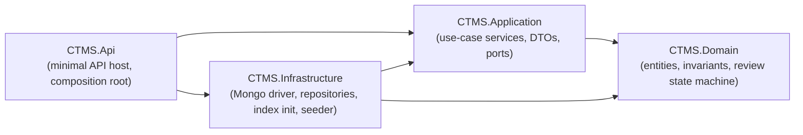
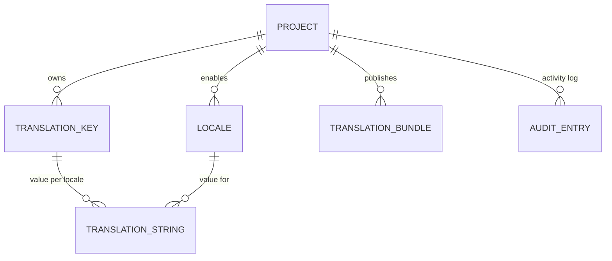
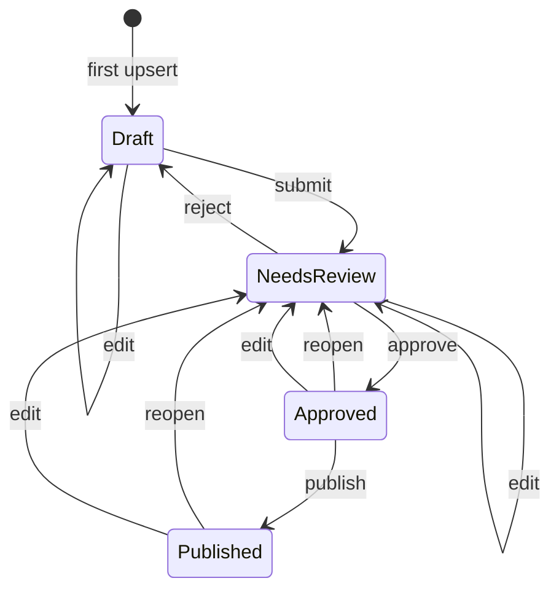

# CTMS architecture

Centralised Translation Management System - a .NET 10 / C# service that stores
translation strings for many projects and locales, runs them through a
review/approval workflow, and serves immutable published bundles to client
applications.

> **Implementation status (backend mid-rewrite).** The persistence layer has
> been switched from PostgreSQL / EF Core to **MongoDB** - see
> [ADR&nbsp;0002](adr/0002-mongodb-as-primary-store.md).
>
> On the current branch:
> - **Implemented:** the four-project solution; the `Project` / `Locale` /
>   `TranslationKey` / `TranslationString` aggregates and their CRUD +
>   review endpoints; the `TranslationBundle` and `AuditEntry` aggregates;
>   the review workflow including the `Published` state; inline audit writes in
>   `TranslationStringService`; `AuditService` (read); the full MongoDB
>   persistence layer - `AddInfrastructure` wiring, `CtmsMongoContext`, BSON
>   mapping, all six repositories, the `MongoHealthCheck` readiness probe, the
>   `MongoIndexInitializer` and `DataSeeder` hosted services. EF Core, its
>   configs, `CtmsDbContext`, the `InitialCreate` migration and
>   `.config/dotnet-tools.json` have been deleted.
> - **Planned (no code yet):** the bundle-assembly / publish service and its
>   HTTP endpoint, the audit / history HTTP endpoint, and the Redis cache.
>
> Items below are tagged _(planned)_ where no code for them exists yet.

---

## 1. Solution layout

Four projects under `src/`, tests under `tests/`. Dependencies point inward -
nothing in `Domain` references `Application`; nothing in `Application` references
`Infrastructure` or ASP.NET.

| Project | Responsibility | Key types |
|---------|----------------|-----------|
| **CTMS.Domain** | Entities and domain logic. No framework dependencies. Entities derive from `Entity` (`Guid Id`, `CreatedAt`, `UpdatedAt` with `internal` setters); constructors and methods guard invariants; setters are private. `[InternalsVisibleTo("CTMS.Infrastructure")]` lets the persistence layer stamp timestamps and advance `TranslationString.Version`. | `Project`, `Locale`, `TranslationKey`, `TranslationString`, `TranslationBundle`, `AuditEntry`; `ReviewState`, `AuditAction`, `InvalidReviewTransitionException` |
| **CTMS.Application** | Use-case orchestration and the ports it needs. DTOs - never entities - cross the API boundary. `AddApplication()` registers the services. | `ProjectService`, `LocaleService`, `TranslationKeyService`, `TranslationStringService`, `AuditService`; `IProjectRepository`, `ILocaleRepository`, `ITranslationKeyRepository`, `ITranslationStringRepository`, `ITranslationBundleRepository`, `IAuditRepository`, `IUnitOfWork`; `PagedResult<T>`, `Slug`, the application exception types |
| **CTMS.Infrastructure** | Data access. `AddInfrastructure(IConfiguration)` wires the Mongo client/context, the six repositories, `NoOpUnitOfWork`, the readiness health check, and two hosted startup services. | `CtmsMongoContext` / `IMongoContext`, `MongoMappingRegistration`, `MongoOptions`, `EntityStamps`, `NoOpUnitOfWork`, `MongoWriteExceptions`, `Persistence/Repositories/*Repository`, `MongoHealthCheck`, `MongoIndexInitializer`, `DataSeeder` |
| **CTMS.Api** | Minimal-API host. Composition root only - it references Infrastructure solely to call `AddInfrastructure`. Endpoints grouped per resource; known exceptions become RFC 7807 ProblemDetails via `ApplicationExceptionHandler`. | `Program.cs`, `Endpoints/*Endpoints.cs`, `Infrastructure/ApplicationExceptionHandler.cs` |

There is **no authentication yet** - each endpoint group carries a `// TODO: auth`
marker where `RequireAuthorization()` will go, and `Program.cs` documents the
expected JWT-bearer wiring. _(planned)_

---

## 2. Domain aggregates

| Aggregate | Fields | Invariants / uniqueness |
|-----------|--------|-------------------------|
| **Project** | `Id`, `Name`, `Slug`, `Description?`, `BaseLocaleCode`, `CreatedAt`, `UpdatedAt` | `Slug` unique, lower-cased, trimmed; `Name` and `BaseLocaleCode` non-blank. Slug is derived from the name when omitted (`Slug` helper). |
| **Locale** | `Id`, `ProjectId`, `Code` (BCP-47), `DisplayName`, `IsRtl`, `CreatedAt`, `UpdatedAt` | Unique `(ProjectId, Code)`. `Code` trimmed, casing preserved; `DisplayName` non-blank. |
| **TranslationKey** | `Id`, `ProjectId`, `KeyName` (dotted path), `Description?`, `CreatedAt`, `UpdatedAt` | Unique `(ProjectId, KeyName)`. `KeyName` matches `[A-Za-z0-9_.-]+`. |
| **TranslationString** | `Id`, `TranslationKeyId`, `LocaleId`, `Value`, `ReviewState`, `UpdatedBy`, `Version` (`long`), `CreatedAt`, `UpdatedAt` | Unique `(TranslationKeyId, LocaleId)`. `ReviewState` moves only through `ChangeReviewState` (§3). `Version` is the optimistic-concurrency token, incremented by the persistence layer on every stored update. |
| **TranslationBundle** | `Id`, `ProjectId`, `LocaleCode` (string, BCP-47), `Version` (`int`, starts at 1), `Entries` (`IReadOnlyDictionary<string,string>`, ordinal), `ETag`, `CreatedBy`, `CreatedAt`, `UpdatedAt` | Append-only - never mutated after creation. `Version` is monotonic per `(ProjectId, LocaleCode)`. `ETag` is derived from `Entries` at construction (see §4). |
| **AuditEntry** | `Id`, `ProjectId`, `EntityType` (e.g. `"TranslationString"`), `EntityId`, `Action` (`AuditAction`), `Actor`, `Timestamp` (UTC), `FromState?`, `ToState?` (`ReviewState`), `Detail?`, `CreatedAt`, `UpdatedAt` | Write-once - never updated or deleted. `AuditAction` = `Created`, `Edited`, `Submitted`, `Approved`, `Rejected`, `Reopened`, `Published`. |

> `TranslationBundle` and `AuditEntry`, their repositories
> (`TranslationBundleRepository`, `AuditRepository`) and `AuditService` (read)
> all exist today. The bundle-assembly / publish service and the HTTP endpoints
> that expose bundles and audit history are _(planned)_.

---

## 3. Translation lifecycle

Each `TranslationString` moves through this state machine. Legal transitions live
on `TranslationString.ChangeReviewState(target, reviewedBy)`; every other
`(from, to)` pair throws `InvalidReviewTransitionException` (HTTP 409). A
successful transition sets `UpdatedBy` to the reviewer and the persistence layer
advances `Version`.

Review actions accepted by `POST .../review` (`action` verb -> target state, and
the `AuditAction` recorded):

| `action` | from -> to | audit |
|----------|-----------|-------|
| `submit` | Draft -> NeedsReview | `Submitted` |
| `approve` | NeedsReview -> Approved | `Approved` |
| `reject` | NeedsReview -> Draft | `Rejected` |
| `reopen` | Approved -> NeedsReview, **or** Published -> NeedsReview | `Reopened` |
| `publish` | Approved -> Published | `Published` |

**Edit semantics.** `TranslationString.Edit(value, editedBy)` (invoked by the
string upsert when the row already exists): editing a `Draft` leaves it `Draft`;
editing any non-draft (`NeedsReview`, `Approved`, `Published`) resets it to
`NeedsReview`, so approved or published text cannot be changed without
re-review. The upsert records an `Edited` audit entry with the from/to states.

**Audit.** Every state-changing operation on a `TranslationString` writes an
`AuditEntry` inline within the same use case, before `IUnitOfWork.SaveChangesAsync`
(`Created` on first upsert, `Edited` on edit, and the verb-specific action on a
review transition). `AuditService` is read-only - it only projects entries.

---

## 4. Publishing and immutable bundles

_The bundle-assembly service and the HTTP endpoint are planned; the domain type
and repository exist._

The pieces in place today:

- `TranslationString` can be moved `Approved -> Published` one string at a time
  via the review endpoint (`action: "publish"`).
- `ITranslationStringRepository.ListByLocaleAndStateAsync(localeId, state)`
  reads every string for a locale in a given state - the query a bundle build
  runs against `Published`.
- `TranslationBundle` is an immutable aggregate; `TranslationBundleRepository`
  implements `GetLatestAsync` (sort by `Version` desc), `GetByVersionAsync`, and
  `InsertAsync` (catches E11000 and throws `ConflictException` when
  `(ProjectId, LocaleCode, Version)` is taken).

Not yet written: the service that assembles a bundle from a locale's strings,
and the HTTP endpoint that publishes / serves it. Target publish flow:

1. Caller publishes a `(project, locale)`.
2. The service reads every `Published` (or `Approved`, TBD by `backend-core`)
   string for that locale and freezes their `keyName -> value` pairs.
3. A new `TranslationBundle` is created with the next `Version` for that
   `(ProjectId, LocaleCode)` (starting at 1). Older versions are retained.
4. An `AuditEntry` (`Published`) is written.
5. The document is inserted and never updated - re-publishing makes a new
   version.

### ETag

`TranslationBundle.ETag` is computed at construction by
`TranslationBundle.ComputeETag(entries)`:

- Sort entries by key, ordinal.
- For each, append `key`, `"\n"`, `value`, `"\n"` to a buffer.
- `ETag` = lowercase hex SHA-256 of that buffer's UTF-8 bytes.

It is the **raw hash** - callers wrap it in double quotes to use it as an HTTP
entity tag. The delivery endpoint (`GET .../bundles/{locale}`, _(planned)_,
[api.md](api.md#planned-endpoints)) returns the latest bundle with this `ETag`;
a conditional request with a matching `If-None-Match` gets `304 Not Modified`.

---

## 5. Persistence - MongoDB

Driver: `MongoDB.Driver` 3.11.1. `AddInfrastructure(IConfiguration)` registers a
singleton `IMongoClient` from `ConnectionStrings:CtmsDatabase`, a singleton
`IMongoContext` -> `CtmsMongoContext` (the driver's collection handles are
thread-safe) bound to the `Mongo:Database` database (default `ctms`), the six
scoped repositories, `NoOpUnitOfWork` as a singleton `IUnitOfWork`, the
`MongoHealthCheck` (name `database`, tag `ready`), and two `IHostedService`s -
`MongoIndexInitializer` and `DataSeeder`. `MongoMappingRegistration.Register()`
is called during wiring.

### Collections

Names are constants on `CtmsMongoContext`. All indexes below are created by
`MongoIndexInitializer` on startup:

| Constant | Collection | Document | Indexes |
|----------|------------|----------|---------|
| `ProjectsCollection` | `projects` | Project | `{ slug: 1 }` unique |
| `LocalesCollection` | `locales` | Locale | `{ projectId: 1, code: 1 }` unique |
| `TranslationKeysCollection` | `translationKeys` | TranslationKey | `{ projectId: 1, keyName: 1 }` unique |
| `TranslationStringsCollection` | `translationStrings` | TranslationString | `{ translationKeyId: 1, localeId: 1 }` unique |
| `TranslationBundlesCollection` | `translationBundles` | TranslationBundle | `{ projectId: 1, localeCode: 1, version: 1 }` unique |
| `AuditEntriesCollection` | `auditEntries` | AuditEntry | `{ projectId: 1, timestamp: 1 }`, `{ entityType: 1, entityId: 1, timestamp: 1 }` (both non-unique) |

The unique indexes carry the constraints PostgreSQL foreign keys and unique
indexes used to enforce. Referential integrity the database no longer guarantees
("a locale's project exists"; cascade delete of a key's or locale's strings) is
enforced in the application services and by explicit multi-collection cleanup in
the repositories.

### BSON mapping (`MongoMappingRegistration.Register()`, idempotent)

- GUIDs stored as the standard UUID BSON subtype everywhere, including `_id`
  (`Id` is mapped as the id member for every entity).
- Conventions applied to every `CTMS.*` type: camelCase element names,
  `IgnoreExtraElements` (tolerate unknown fields - additive schema evolution),
  enums stored as strings (`ReviewState`, `AuditAction`).
- `TranslationBundle.Entries` is mapped as an array of `{ k, v }` documents
  (`DictionaryRepresentation.ArrayOfDocuments`) so arbitrary key names are safe.

### Index creation

`MongoIndexInitializer` (an `IHostedService`, registered by `AddInfrastructure`)
calls `createIndexes` for every collection on startup via
`EnsureIndexesAsync(IMongoContext)`. It is idempotent - MongoDB ignores an
already-present index with the same key and options - so it runs unconditionally
in every environment; a fresh database is ready after the first boot.
**There is no migration tool.** The `dotnet-ef` tool and the `InitialCreate`
migration are gone. Shape changes are handled by additive, unknown-field-tolerant
mapping and one-off backfill commands when a rewrite is unavoidable.

### Optimistic concurrency

`TranslationString.Version` is a `long` with an `internal` setter (the
`CTMS.Infrastructure` assembly has `InternalsVisibleTo` access). The string
repository's `UpdateAsync` issues a filtered write -
`{ _id: <id>, version: <expected> }`, `$set` advancing `version` - and a
matched-count of 0 means someone else won the race. It raises
`ConcurrencyException(currentVersion)` (a `long`), which the API returns as `409`
with `extensions.currentVersion`.

> On PostgreSQL the token was the system column `xmin`, mapped read-only. On
> MongoDB the application owns the increment. The public contract
> (`expectedVersion` in the request, `version` in the DTO, `currentVersion` in
> the 409 body) is unchanged apart from widening `uint` -> `long`.

### Unit of work

`NoOpUnitOfWork.SaveChangesAsync` returns 0 and does nothing: every repository
call is a single-document atomic write that is already durable when it returns.
The services still call it so their use cases read as a unit of work, and so a
future multi-document transaction has one seam to hook.

### Timestamps

`EntityStamps.StampCreated` / `StampUpdated` (extension methods on `Entity`) set
`CreatedAt` / `UpdatedAt` in the repositories just before a write - the role
`CtmsDbContext.SaveChanges` played under EF.

### Duplicate keys

`MongoWriteExceptions.IsDuplicateKey` recognises E11000; repositories translate
it into `ConflictException` / `SlugAlreadyInUseException`, where EF used to raise
typed exceptions.

---

## 6. Redis cache _(planned)_

Published bundles are read-heavy and immutable - a good cache fit.
`AddInfrastructure` will register a connection from `ConnectionStrings:Redis`
(StackExchange.Redis format: `host:port[,options]`).

- `GET .../bundles/{locale}` checks Redis (key e.g.
  `bundle:{projectId}:{localeCode}:latest`) before MongoDB; a miss reads Mongo
  and populates the cache.
- The cached entry holds the serialized bundle plus its `ETag`, so an
  `If-None-Match` / `304` check needs no database round-trip.
- Publishing a new version writes/evicts the cache key. Because bundles are
  immutable, entries only ever need replacing for a newer version, never for a
  content change.
- If Redis is unreachable the service degrades to MongoDB-only; the cache is an
  optimisation, not a source of truth.

---

## 7. Health checks

| Route | Purpose | Checks |
|-------|---------|--------|
| `GET /health` | Liveness | none - `200` while the process runs |
| `GET /health/ready` | Readiness | `MongoHealthCheck` (name `database`, tag `ready`) runs `{ ping: 1 }` against the configured database. _(planned)_ a Redis ping once the cache lands. |

---

## 8. Configuration and secrets

| Key | Env override | Meaning | Local default |
|-----|--------------|---------|---------------|
| `ConnectionStrings:CtmsDatabase` | `ConnectionStrings__CtmsDatabase` | MongoDB connection string | `mongodb://mongo:27017` (compose) |
| `Mongo:Database` | `Mongo__Database` | Database name within the Mongo server (`MongoOptions`, default `ctms`) | `ctms` |
| `ConnectionStrings:Redis` | `ConnectionStrings__Redis` | Redis connection string | `redis:6379` (compose) |
| `Seed:Enabled` | `Seed__Enabled` | Run the dev data seeder on startup _(planned)_ | `true` in compose; set `false` for staging/prod |
| `ASPNETCORE_ENVIRONMENT` | (same) | `Development` enables Swagger (and the seeder) | `Development` |

- Config binds `appsettings.json` -> `appsettings.{Environment}.json` ->
  environment variables (`__` maps to `:`).
- **No credentials are committed.** `appsettings.json` ships a passwordless
  localhost placeholder (`mongodb://localhost:27017`, `Mongo:Database` = `ctms`).
  `appsettings.Development.json` sets `Seed:Enabled: false`. `.env` is
  git-ignored; `.env.example` is the committed template.
- **Target managed services** (see `deploy/azure/`): Azure Cosmos DB for
  MongoDB (RU serverless by default, vCore optional) and Azure Cache for Redis.
  Their connection strings live in Key Vault as `CtmsDatabase-ConnectionString`
  and `Redis-ConnectionString`; the Container App resolves them via Key Vault
  references and pulls its image via a user-assigned managed identity (AcrPull).
- The container terminates TLS at the ingress and listens HTTP-only on `:8080`
  (root `Dockerfile`).

---

## 9. Testing

`tests/CTMS.Application.Tests` (xUnit) exercises the application services end to
end against real repositories on a real MongoDB; `ReviewWorkflowTests` drives the
`TranslationString` review transitions directly against the domain type.

- The suite uses **`EphemeralMongo`** (3.2.0): a `MongoFixture` starts a
  throwaway `mongod`, shared through the `"mongo"` xUnit collection; each test
  class builds a `CtmsTestHarness` over the fixture's connection string. No
  Docker, no `mongo:7` container needed for `dotnet test` itself - the pipeline's
  service container is belt-and-braces.
- `NuGetAudit` is disabled on the test project only: `EphemeralMongo` pulls
  older `SharpCompress` / `Snappier` transitively and those advisories must not
  trip the warnings-as-errors build. Production projects keep auditing on.
- **Migration in progress:** `ProjectServiceTests` and `LocaleServiceTests` plus
  the csproj are on the new harness; `TranslationKeyServiceTests`,
  `TranslationStringServiceTests` and `ReviewWorkflowTests` had not been ported
  at the time of writing.

Build is warnings-as-errors (`Directory.Build.props`), so any warning fails CI.
