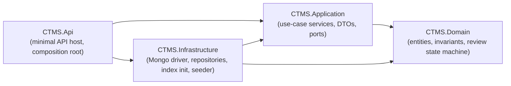
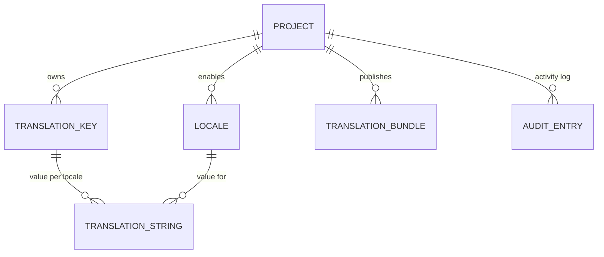
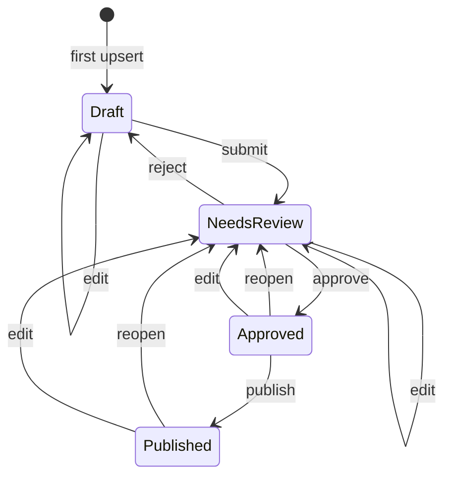
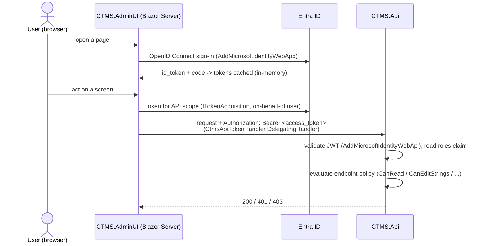

# CTMS architecture

Centralised Translation Management System - a .NET 10 / C# service that stores
translation strings for many projects and locales, runs them through a
review/approval workflow, and serves immutable published bundles to client
applications.

> **Implementation status.** The persistence layer runs on **MongoDB** - see
> [ADR&nbsp;0002](adr/0002-mongodb-as-primary-store.md); production hardening is
> [ADR&nbsp;0003](adr/0003-production-hardening.md).
>
> On the current branch, all of the following is **implemented**:
> - the four-project solution plus `CTMS.Client` (SDK) and the `CTMS.AdminUI`
>   Blazor host;
> - the `Project` / `Locale` / `TranslationKey` / `TranslationString` aggregates
>   and their CRUD + review endpoints;
> - the `TranslationBundle` and `AuditEntry` aggregates, the bundle
>   assembly/publish service (`TranslationBundleService`) and its HTTP endpoints
>   (`POST/GET .../bundles/...`), and the read-only history/audit endpoints
>   (`GET .../history`, `GET .../keys/.../history`);
> - the review workflow including the `Published` state, and inline audit writes
>   in `TranslationStringService` / `TranslationBundleService`;
> - the Redis-backed bundle cache (`IBundleCache` -> `BundleCache` over
>   `IDistributedCache`) fronting the latest-bundle GET, with ETag / `If-None-Match`
>   / `304` conditional handling and an in-process fallback when Redis is unset
>   (WS3 shipped the endpoints, WS4 added caching);
> - the full MongoDB persistence layer - `AddInfrastructure` wiring,
>   `CtmsMongoContext`, BSON mapping, all six repositories, the `MongoHealthCheck`
>   readiness probe, the `MongoIndexInitializer` and `DataSeeder` hosted services;
> - Entra ID JWT-bearer auth + role/policy authorization (§10), with the
>   `Auth:Enabled=false` dev bypass and `Auth:PublicBundleReads` anonymous
>   delivery path.
>
> EF Core, its configs, `CtmsDbContext`, the `InitialCreate` migration and
> `.config/dotnet-tools.json` have been deleted.

---

## 1. Solution layout

Four projects under `src/`, tests under `tests/`. Dependencies point inward -
nothing in `Domain` references `Application`; nothing in `Application` references
`Infrastructure` or ASP.NET.

| Project | Responsibility | Key types |
|---------|----------------|-----------|
| **CTMS.Domain** | Entities and domain logic. No framework dependencies. Most entities derive from `Entity` (`Guid Id`, `CreatedAt`, `UpdatedAt` with `internal` setters); constructors and methods guard invariants; setters are private. `[InternalsVisibleTo("CTMS.Infrastructure")]` lets the persistence layer stamp timestamps and advance `TranslationString.Version`. `AuditEntry` is the exception - it is append-only and carries only `Id` and `Timestamp`, so it does not derive from `Entity`. | `Project`, `Locale`, `TranslationKey`, `TranslationString`, `TranslationBundle`, `AuditEntry`; `ReviewState`, `AuditAction`, `InvalidReviewTransitionException` |
| **CTMS.Application** | Use-case orchestration and the ports it needs. DTOs - never entities - cross the API boundary. `AddApplication()` registers the services. | `ProjectService`, `LocaleService`, `TranslationKeyService`, `TranslationStringService`, `AuditService`; `IProjectRepository`, `ILocaleRepository`, `ITranslationKeyRepository`, `ITranslationStringRepository`, `ITranslationBundleRepository`, `IAuditRepository`, `IUnitOfWork`; `PagedResult<T>`, `Slug`, the application exception types |
| **CTMS.Infrastructure** | Data access. `AddInfrastructure(IConfiguration)` wires the Mongo client/context, the six repositories, `NoOpUnitOfWork`, the readiness health check, and two hosted startup services. | `CtmsMongoContext` / `IMongoContext`, `MongoMappingRegistration`, `MongoOptions`, `EntityStamps`, `NoOpUnitOfWork`, `MongoWriteExceptions`, `Persistence/Repositories/*Repository`, `MongoHealthCheck`, `MongoIndexInitializer`, `DataSeeder` |
| **CTMS.Api** | Minimal-API host. Composition root only - it references Infrastructure solely to call `AddInfrastructure`. Endpoints grouped per resource; known exceptions become RFC 7807 ProblemDetails via `ApplicationExceptionHandler`. | `Program.cs`, `Endpoints/*Endpoints.cs`, `Infrastructure/ApplicationExceptionHandler.cs` |

Authentication and role-based authorization are wired (Microsoft Entra ID / JWT
bearer) - see [§10 Security](#10-security). Every `/api/*` endpoint carries a
named authorization policy; `/health` and Swagger are anonymous.

---

## 2. Domain aggregates

| Aggregate | Fields | Invariants / uniqueness |
|-----------|--------|-------------------------|
| **Project** | `Id`, `Name`, `Slug`, `Description?`, `BaseLocaleCode`, `CreatedAt`, `UpdatedAt` | `Slug` unique, lower-cased, trimmed; `Name` and `BaseLocaleCode` non-blank. Slug is derived from the name when omitted (`Slug` helper). |
| **Locale** | `Id`, `ProjectId`, `Code` (BCP-47), `DisplayName`, `IsRtl`, `CreatedAt`, `UpdatedAt` | Unique `(ProjectId, Code)`. `Code` trimmed, casing preserved; `DisplayName` non-blank. |
| **TranslationKey** | `Id`, `ProjectId`, `KeyName` (dotted path), `Description?`, `CreatedAt`, `UpdatedAt` | Unique `(ProjectId, KeyName)`. `KeyName` matches `[A-Za-z0-9_.-]+`. |
| **TranslationString** | `Id`, `TranslationKeyId`, `LocaleId`, `Value`, `ReviewState`, `UpdatedBy`, `Version` (`long`), `CreatedAt`, `UpdatedAt` | Unique `(TranslationKeyId, LocaleId)`. `ReviewState` moves only through `ChangeReviewState` (§3). `Version` is the optimistic-concurrency token, incremented by the persistence layer on every stored update. |
| **TranslationBundle** | `Id`, `ProjectId`, `LocaleCode` (string, BCP-47), `Version` (`int`, starts at 1), `Entries` (`IReadOnlyDictionary<string,string>`, ordinal), `ETag`, `CreatedBy`, `CreatedAt`, `UpdatedAt` | Append-only - never mutated after creation. `Version` is monotonic per `(ProjectId, LocaleCode)`. `ETag` is derived from `Entries` at construction (see §4). |
| **AuditEntry** | `Id`, `ProjectId`, `EntityType` (e.g. `"TranslationString"`), `EntityId`, `Action` (`AuditAction`), `Actor`, `Timestamp` (UTC), `FromState?`, `ToState?` (`ReviewState`), `Detail?` | Write-once - never updated or deleted, so it has no `CreatedAt`/`UpdatedAt`; `Timestamp` is the single time field. `AuditAction` = `Created`, `Edited`, `Submitted`, `Approved`, `Rejected`, `Reopened`, `Published`. |

> `TranslationBundle` and `AuditEntry`, their repositories
> (`TranslationBundleRepository`, `AuditRepository`), `AuditService` (read), the
> bundle-assembly / publish service (`TranslationBundleService`) and the HTTP
> endpoints that expose bundles and audit history all exist today. See §4 and
> [api.md](api.md#bundles).

---

## 3. Translation lifecycle

Each `TranslationString` moves through this state machine. Legal transitions live
on `TranslationString.ChangeReviewState(target, reviewedBy)`; every other
`(from, to)` pair throws `InvalidReviewTransitionException` (HTTP 409). A
successful transition sets `UpdatedBy` to the reviewer and the persistence layer
advances `Version`.

Review actions accepted by `POST .../review` (`action` verb -> target state, and
the `AuditAction` recorded):

| `action` | from -> to | audit |
|----------|-----------|-------|
| `submit` | Draft -> NeedsReview | `Submitted` |
| `approve` | NeedsReview -> Approved | `Approved` |
| `reject` | NeedsReview -> Draft | `Rejected` |
| `reopen` | Approved -> NeedsReview, **or** Published -> NeedsReview | `Reopened` |
| `publish` | Approved -> Published | `Published` |

**Edit semantics.** `TranslationString.Edit(value, editedBy)` (invoked by the
string upsert when the row already exists): editing a `Draft` leaves it `Draft`;
editing any non-draft (`NeedsReview`, `Approved`, `Published`) resets it to
`NeedsReview`, so approved or published text cannot be changed without
re-review. The upsert records an `Edited` audit entry with the from/to states.

**Audit.** Every state-changing operation on a `TranslationString` writes an
`AuditEntry` inline within the same use case, before `IUnitOfWork.SaveChangesAsync`
(`Created` on first upsert, `Edited` on edit, and the verb-specific action on a
review transition). `AuditService` is read-only - it only projects entries.

---

## 4. Publishing and immutable bundles

Shipped in WS3 (endpoints) and WS4 (caching). `TranslationBundleService`
(`CTMS.Application/Translations`) assembles bundles; `BundleEndpoints`
(`CTMS.Api/Endpoints`) exposes them; `BundleCache` fronts the latest-bundle GET.
Full route reference: [api.md → Bundles](api.md#bundles).

### Publish flow (`POST /api/projects/{projectId}/bundles/{localeCode}`)

1. Caller publishes a `(project, locale)`. `{localeCode}` is the BCP-47 code, not
   a GUID; it is matched against the project's locales.
2. The service reads every `TranslationString` for that locale whose
   `ReviewState` is **`Published`** (strings reach that state one at a time via
   the review `publish` action), joins each to its `TranslationKey.KeyName`, and
   freezes the `keyName -> value` map.
3. A new `TranslationBundle` is created with the next `Version` for that
   `(ProjectId, LocaleCode)` - `latest.version + 1`, starting at 1. Older
   versions are retained forever.
4. Publishing **never changes any string's `ReviewState`** - it only snapshots.
5. An `AuditEntry` (`Published`, `entityType = "TranslationBundle"`) is written.
6. The document is inserted and never updated; the `(ProjectId, LocaleCode,
   Version)` unique index makes a concurrent publish that grabbed the same next
   version fail `409` (`ConflictException`). Publishing with zero `Published`
   strings is rejected `400` - no empty bundle is created.
7. The service invalidates the cache key for that `(project, locale)`.

`POST .../bundles/{localeCode}` requires the `CanPublish` policy (admin /
manager). This is a separate step from the review `publish` action on a single
string, which requires `CanReview`.

### Delivery and the ETag

`TranslationBundle.ETag` is computed at construction by
`TranslationBundle.ComputeETag(entries)`:

- Sort entries by key, ordinal.
- For each, append `key`, `"\n"`, `value`, `"\n"` to a buffer.
- `ETag` = lowercase hex SHA-256 of that buffer's UTF-8 bytes.

It is the **raw hash** - the endpoint wraps it in double quotes to use it as a
strong HTTP entity tag. Two publishes with identical content therefore produce
byte-identical ETags.

`GET /api/projects/{projectId}/bundles/{localeCode}` returns the latest bundle
and is an HTTP conditional GET:

- every `200` and every `304` carries `ETag: "<etag>"` and `Cache-Control: no-cache`;
- a request whose `If-None-Match` contains a matching tag (quoted, `W/`-weak,
  comma-lists, repeated headers and `*` are all accepted) gets `304 Not Modified`
  with no body;
- otherwise it is `200` with the full `TranslationBundleDto`.

These three GET routes (`/{localeCode}`, `/{localeCode}/versions`,
`/{localeCode}/versions/{version}`) are **anonymous by default** - they are the
SDK / CDN delivery path. Setting `Auth:PublicBundleReads=false` makes them
require `CanRead` instead (§10). The `versions` and by-version routes are
uncached and unconditioned.

Caching for the latest route is §6.

---

## 5. Persistence - MongoDB

Driver: `MongoDB.Driver` 3.11.1. `AddInfrastructure(IConfiguration)` registers a
singleton `IMongoClient` from `ConnectionStrings:CtmsDatabase`, a singleton
`IMongoContext` -> `CtmsMongoContext` (the driver's collection handles are
thread-safe) bound to the `Mongo:Database` database (default `ctms`), the six
scoped repositories, `NoOpUnitOfWork` as a singleton `IUnitOfWork`, the
`MongoHealthCheck` (name `database`, tag `ready`), and two `IHostedService`s -
`MongoIndexInitializer` and `DataSeeder`. `MongoMappingRegistration.Register()`
is called during wiring.

### Collections

Names are constants on `CtmsMongoContext`. All indexes below are created by
`MongoIndexInitializer` on startup:

| Constant | Collection | Document | Indexes |
|----------|------------|----------|---------|
| `ProjectsCollection` | `projects` | Project | `{ slug: 1 }` unique |
| `LocalesCollection` | `locales` | Locale | `{ projectId: 1, code: 1 }` unique |
| `TranslationKeysCollection` | `translationKeys` | TranslationKey | `{ projectId: 1, keyName: 1 }` unique |
| `TranslationStringsCollection` | `translationStrings` | TranslationString | `{ translationKeyId: 1, localeId: 1 }` unique |
| `TranslationBundlesCollection` | `translationBundles` | TranslationBundle | `{ projectId: 1, localeCode: 1, version: 1 }` unique |
| `AuditEntriesCollection` | `auditEntries` | AuditEntry | `{ projectId: 1, timestamp: 1 }`, `{ entityType: 1, entityId: 1, timestamp: 1 }` (both non-unique) |

The unique indexes carry the constraints PostgreSQL foreign keys and unique
indexes used to enforce. Referential integrity the database no longer guarantees
("a locale's project exists"; cascade delete of a key's or locale's strings) is
enforced in the application services and by explicit multi-collection cleanup in
the repositories.

### BSON mapping (`MongoMappingRegistration.Register()`, idempotent)

- GUIDs stored as the standard UUID BSON subtype everywhere, including `_id`
  (`Id` is mapped as the id member for every entity).
- Conventions applied to every `CTMS.*` type: camelCase element names,
  `IgnoreExtraElements` (tolerate unknown fields - additive schema evolution),
  enums stored as strings (`ReviewState`, `AuditAction`).
- `TranslationBundle.Entries` is mapped as an array of `{ k, v }` documents
  (`DictionaryRepresentation.ArrayOfDocuments`) so arbitrary key names are safe.

### Index creation

`MongoIndexInitializer` (an `IHostedService`, registered by `AddInfrastructure`)
calls `createIndexes` for every collection on startup via
`EnsureIndexesAsync(IMongoContext)`. It is idempotent - MongoDB ignores an
already-present index with the same key and options - so it runs unconditionally
in every environment; a fresh database is ready after the first boot.
**There is no migration tool.** The `dotnet-ef` tool and the `InitialCreate`
migration are gone. Shape changes are handled by additive, unknown-field-tolerant
mapping and one-off backfill commands when a rewrite is unavoidable.

### Optimistic concurrency

`TranslationString.Version` is a `long` with an `internal` setter (the
`CTMS.Infrastructure` assembly has `InternalsVisibleTo` access). The string
repository's `UpdateAsync` issues a filtered write -
`{ _id: <id>, version: <expected> }`, `$set` advancing `version` - and a
matched-count of 0 means someone else won the race. It raises
`ConcurrencyException(currentVersion)` (a `long`), which the API returns as `409`
with `extensions.currentVersion`.

> On PostgreSQL the token was the system column `xmin`, mapped read-only. On
> MongoDB the application owns the increment. The public contract
> (`expectedVersion` in the request, `version` in the DTO, `currentVersion` in
> the 409 body) is unchanged apart from widening `uint` -> `long`.

### Unit of work

`NoOpUnitOfWork.SaveChangesAsync` returns 0 and does nothing: every repository
call is a single-document atomic write that is already durable when it returns.
The services still call it so their use cases read as a unit of work, and so a
future multi-document transaction has one seam to hook.

### Timestamps

`EntityStamps.StampCreated` / `StampUpdated` (extension methods on `Entity`) set
`CreatedAt` / `UpdatedAt` in the repositories just before a write - the role
`CtmsDbContext.SaveChanges` played under EF.

### Duplicate keys

`MongoWriteExceptions.IsDuplicateKey` recognises E11000; repositories translate
it into `ConflictException` / `SlugAlreadyInUseException`, where EF used to raise
typed exceptions.

---

## 6. Redis cache

Published bundles are read-heavy and immutable - a good cache fit.
`AddInfrastructure` registers an `IDistributedCache`: **StackExchange.Redis**
(`AddStackExchangeRedisCache`) when `ConnectionStrings:Redis` is set
(format `host:port[,options]`), otherwise an in-process distributed-memory cache
so a local `dotnet run` needs no Redis. `CacheModeLogger` logs which backend is
active once at startup. `BundleCache` (implements `IBundleCache`) wraps it.

- Only `GET /api/projects/{projectId}/bundles/{localeCode}` (latest) is cached.
  It checks the cache before MongoDB; a miss reads Mongo and populates the cache.
- Key: **`ctms:bundle:{projectId}:{localeCode}:latest`**, locale code trimmed and
  lower-cased (`BundleCache.KeyFor`).
- The cached entry is the serialized `TranslationBundleDto`, whose `etag` member
  carries the content hash - so an `If-None-Match` / `304` check needs no
  database round-trip on a hit.
- TTL is `Cache:BundleTtlMinutes` (default 60; `<= 0` falls back to 60).
- Publishing a new version calls `InvalidateAsync` for that `(project, locale)`.
  Because bundles are immutable, an entry only ever needs replacing for a newer
  version, never for a content change.
- Every cache call is wrapped: a read/write/invalidate failure is logged and
  treated as a miss, so the service degrades to MongoDB-only. The cache is an
  optimisation, not a source of truth - and there is no Redis readiness probe
  for that reason (§7).

---

## 7. Health checks

| Route | Purpose | Checks |
|-------|---------|--------|
| `GET /health` | Liveness | none - `200` while the process runs |
| `GET /health/ready` | Readiness | `MongoHealthCheck` (name `database`, tag `ready`) runs `{ ping: 1 }` against the configured database. There is **no** Redis check: the bundle cache degrades to MongoDB-only if Redis is down, so it is not a readiness dependency. |

---

## 8. Configuration and secrets

| Key | Env override | Meaning | Local default |
|-----|--------------|---------|---------------|
| `ConnectionStrings:CtmsDatabase` | `ConnectionStrings__CtmsDatabase` | MongoDB connection string | `mongodb://mongo:27017` (compose) |
| `Mongo:Database` | `Mongo__Database` | Database name within the Mongo server (`MongoOptions`, default `ctms`) | `ctms` |
| `ConnectionStrings:Redis` | `ConnectionStrings__Redis` | Redis connection string for the bundle cache; unset = in-process memory cache | `redis:6379` (compose) |
| `Cache:BundleTtlMinutes` | `Cache__BundleTtlMinutes` | TTL for a cached latest bundle (`BundleCacheOptions`); `<= 0` falls back to 60 | `60` |
| `Seed:Enabled` | `Seed__Enabled` | Run the dev data seeder on startup (Development only, and only when `true`) | `true` in compose; `false` in `appsettings.Development.json` |
| `ASPNETCORE_ENVIRONMENT` | (same) | `Development` enables Swagger (and the seeder) | `Development` |
| `AzureAd:Instance` / `:TenantId` / `:ClientId` / `:Audience` | `AzureAd__*` | Entra ID app registration for JWT-bearer validation (§10) | placeholders; set in user-secrets / Key Vault |
| `Auth:Enabled` | `Auth__Enabled` | `false` = permissive all-roles bypass (local/tests). Refused under `Production`. | `false` in `appsettings.Development.json`, else `true` |
| `Auth:PublicBundleReads` | `Auth__PublicBundleReads` | `true` = bundle delivery GETs are anonymous; `false` = require `CanRead` | `true` |
| `Cors:AllowedOrigins` | `Cors__AllowedOrigins__0`, ... | String array of allowed browser origins for the `"ctms"` CORS policy. Empty ⇒ no cross-origin access (§11, [ADR&nbsp;0003](adr/0003-production-hardening.md)) | `[]` in `appsettings.Production.json` |
| `RateLimit:Enabled` | `RateLimit__Enabled` | Master switch for the global rate limiter (§11) | `true`; `false` in the integration test factory |
| `RateLimit:PermitPerWindow` / `:WindowSeconds` / `:QueueLimit` / `:BundlePermitPerWindow` | `RateLimit__*` | Fixed-window limiter knobs | `120` / `60` / `0` / `PermitPerWindow × 5` |
| `Limits:MaxRequestBodyBytes` | `Limits__MaxRequestBodyBytes` | Max request body size (Kestrel + a `413` middleware); `<= 0` ⇒ default (§11) | `262144` (256 KB) |

> `appsettings.Production.json` only overrides `Cors:AllowedOrigins`,
> `RateLimit:Enabled`, `Auth:Enabled` and `Seed:Enabled`; the numeric
> rate-limit / body-size knobs use the code defaults above. See §11 and
> [ADR&nbsp;0003](adr/0003-production-hardening.md).

- Config binds `appsettings.json` -> `appsettings.{Environment}.json` ->
  environment variables (`__` maps to `:`).
- **No credentials are committed.** `appsettings.json` ships a passwordless
  localhost placeholder (`mongodb://localhost:27017`, `Mongo:Database` = `ctms`).
  `appsettings.Development.json` sets `Seed:Enabled: false`. `.env` is
  git-ignored; `.env.example` is the committed template.
- **Target managed services** (see `deploy/azure/`): Azure Cosmos DB for
  MongoDB (RU serverless by default, vCore optional) and Azure Cache for Redis.
  Their connection strings live in Key Vault as `CtmsDatabase-ConnectionString`
  and `Redis-ConnectionString`; the Container App resolves them via Key Vault
  references and pulls its image via a user-assigned managed identity (AcrPull).
- The container terminates TLS at the ingress and listens HTTP-only on `:8080`
  (root `Dockerfile`).

---

## 9. Testing

Three test projects, all xUnit. `dotnet test` runs them all; the build is
warnings-as-errors (`Directory.Build.props`), so any warning fails CI.

**`tests/CTMS.Application.Tests`** - application services end to end against real
repositories on a real MongoDB, plus focused unit tests.

- MongoDB via **`EphemeralMongo`** (3.2.0): a `MongoFixture` starts a throwaway
  in-process `mongod`, shared through the `"mongo"` xUnit collection; each test
  class builds a `CtmsTestHarness` (one isolated database, every production index
  applied, all six repositories and all services wired, an in-memory
  `IDistributedCache` standing in for Redis). No Docker needed.
- Covers `Project` / `Locale` / `TranslationKey` / `TranslationString` service
  behaviour, `TranslationBundleService` (assembly, versioning, ETag,
  cache interaction), `AuditService`, project-scoped queries, and the
  `BundleConditionalRequest` `If-None-Match` matcher. `ReviewWorkflowTests`
  drives the `TranslationString` transitions directly against the domain type.
- WS7 unit tests: `AuthorizationPoliciesTests` drives the real authorization
  runtime built from `AuthorizationPolicies.Configure` for every `(role, policy)`
  pair; `TokenActorTests` covers the actor-from-token helper. The project has a
  `FrameworkReference` to `Microsoft.AspNetCore.App` for those ASP.NET types.

**`tests/CTMS.Api.IntegrationTests`** - the full HTTP surface through a
`WebApplicationFactory<DevBypassAuthHandler>` over the real `Program`
composition root and DI graph.

- `MongoFixture` starts one MongoDB for the assembly: it **prefers a real
  `mongo:7` via `Testcontainers.MongoDb`** when a Docker daemon is reachable and
  **falls back to `EphemeralMongo`** otherwise (it throws with both reasons
  rather than skipping if neither starts). `BackendReportTests` surfaces which
  backend ran.
- `CtmsApiFactory` overrides Mongo config with the fixture's connection string,
  leaves `ConnectionStrings:Redis` unset (in-memory cache), sets
  `Seed:Enabled=false` and `Auth:Enabled=false`, then replaces the default auth
  scheme with `TestAuthHandler` so the **real `AuthorizationPolicies`** evaluate
  against header-driven roles (`ClientAs("ctms.reviewer", ...)`).
- Covers the authorization matrix, actor-from-token, optimistic-concurrency
  `409`s, bundle ETag / `304`, history, lifecycle, validation / not-found, and
  health.

**`tests/CTMS.Client.Tests`** - the `CTMS.Client` SDK against a stub
`HttpMessageHandler`: revalidation / `304` / offline-stale state machine, pinned
versions, the locale fallback chain, and `FileBundleStore` round-trip / atomic
write / corruption handling.

`NuGetAudit` is disabled on all three test projects (EphemeralMongo pulls older
`SharpCompress` / `Snappier`; Testcontainers pulls SSH.NET). Shipping projects
keep auditing on, so `dotnet build` still fails on advisories in product code.

---

## 10. Security

Authentication is **Microsoft Entra ID**; authorization is **role-based** via
named policies. `Microsoft.Identity.Web` (3.15.1) on both the API and the
Admin UI.

### App roles → policies

Five Entra app roles (`ctms.admin`, `ctms.manager`, `ctms.reviewer`,
`ctms.translator`, `ctms.reader`) map to six policies (`CanRead`,
`CanEditStrings`, `CanReview`, `CanManageContent`, `CanPublish`,
`CanAdminProjects`). An authenticated principal with **no** recognised role
satisfies no policy (`403` everywhere except `/health` / Swagger). The full
matrix is in [api.md → Authentication & authorization](api.md#authentication--authorization).

### Where it is defined

| Concern | Location |
|---------|----------|
| Role name constants | `src/CTMS.Api/Auth/AuthRoles.cs` (mirror: `src/CTMS.AdminUI/Auth/AuthRoles.cs`) |
| Role → policy mapping (single source) | `src/CTMS.Api/Auth/AuthorizationPolicies.cs` (mirror in `CTMS.AdminUI/Auth`) |
| API auth wiring + Production guard | `src/CTMS.Api/Auth/AuthenticationSetup.cs` (`builder.AddCtmsAuth()`) |
| Endpoint policy assignment | `.RequireAuthorization("<policy>")` in each `src/CTMS.Api/Endpoints/*.cs` |
| Actor-from-token | `src/CTMS.Api/Auth/TokenActor.cs`, called from the string-upsert / review / bundle-publish endpoints |
| Local-dev bypass | `DevBypassAuthHandler` in each project's `Auth/` folder (`Auth:Enabled=false`) |
| Admin UI token acquisition | `src/CTMS.AdminUI/Services/CtmsApiTokenHandler.cs` (scope `Ctms:ApiScope`) |
| Admin UI claims accessor / role gating | `src/CTMS.AdminUI/Services/CurrentUser.cs`, `<AuthorizeView Policy="...">` in pages |

The API↔UI token flow: the UI holds only user tokens (in-memory cache, no
persistence); each outbound API call gets a freshly-acquired access token for
the `Ctms:ApiScope` audience. The API trusts nothing but the validated JWT — the
`updatedBy` / `reviewedBy` / `publishedBy` body fields are overridden with the
token identity whenever a real token is present.

---

## 11. Production hardening

Wired in `Program.cs` from `src/CTMS.Api/Infrastructure/*Setup` helpers; every
item is configuration-driven and inert in `Development` / tests. Rationale and
trade-offs: [ADR&nbsp;0003](adr/0003-production-hardening.md). Config keys: §8.

| Concern | Helper | Behaviour |
|---------|--------|-----------|
| **CORS** | `CorsSetup` (`UseCors` before auth) | One policy `"ctms"`. `Cors:AllowedOrigins` empty ⇒ no cross-origin access; when set, those origins with any header/method, credentials allowed, `ETag` + `Location` exposed. |
| **Rate limiting** | `RateLimitingSetup` (`UseRateLimiter` after auth) | Global fixed-window limiter partitioned by token user-id (authenticated) or remote IP; the anonymous `.../bundles/...` GET path gets a separate looser IP partition. `429` + RFC 7807 + `Retry-After`. `/health*` opt out. Off when `RateLimit:Enabled=false`. |
| **Request-size cap** | `RequestBodySizeLimit` (middleware, early) | `Limits:MaxRequestBodyBytes` (256 KB default) on Kestrel and via a `413` + RFC 7807 middleware that also covers the test host and chunked bodies. |
| **Data Protection** | `DataProtectionSetup` | `SetApplicationName("CTMS")`; key ring persisted to Redis (`ConnectionStrings:Redis`, key `DataProtection-Keys`) so replicas share keys across restarts; local ephemeral fallback + info log when Redis is unset. At-rest key encryption is a `TODO`. |
| **Structured logging** | `LoggingSetup` | JSON console (`AddJsonConsole`, scopes on, UTC) outside Development; `TraceId`/`SpanId`/`ParentId` on every scope (lines up with the `traceId` on ProblemDetails bodies); one HTTP log line per request (method, path, status, elapsed), `/health*` excluded. No third-party logging package. |

`docker-compose.prod.yml` is the compose profile that exercises this (auth on,
`ASPNETCORE_ENVIRONMENT=Production`, Redis required).
