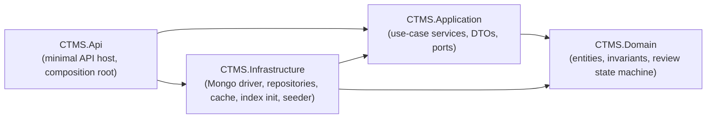
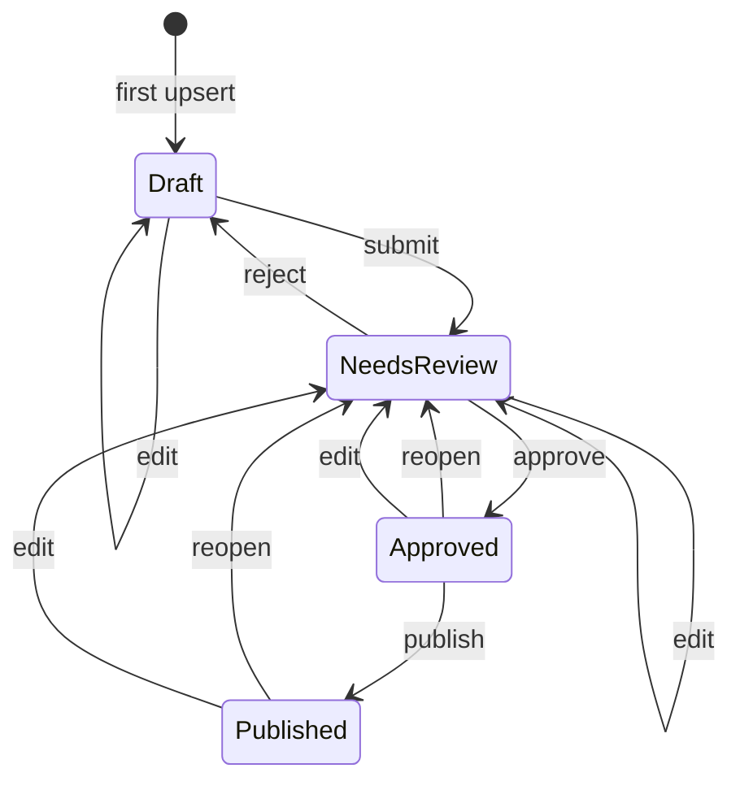
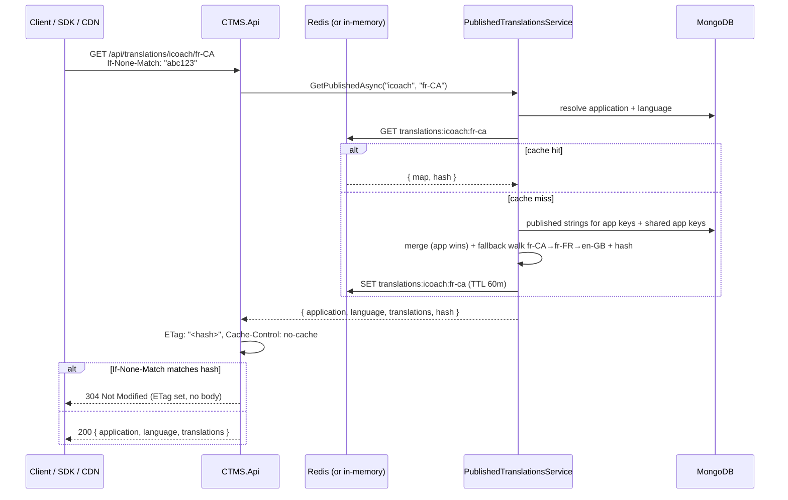
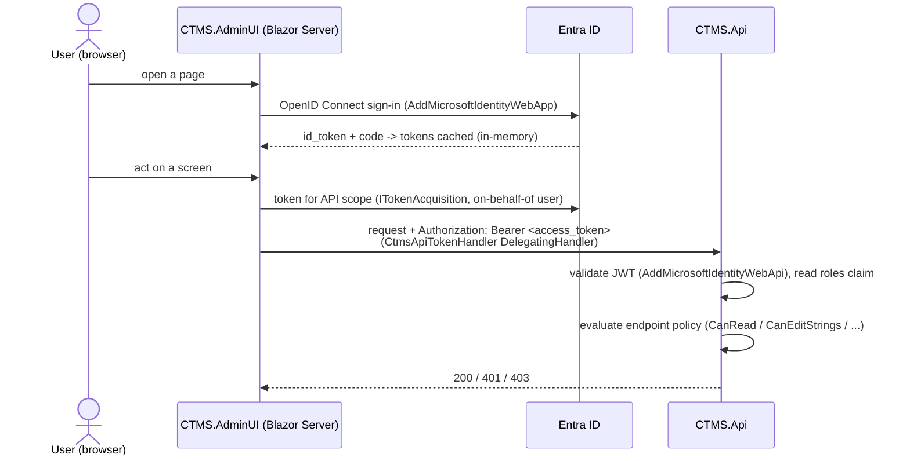

# CTMS architecture

Centralised Translation Management System — a .NET 10 / C# service that stores
translation strings for many **applications** and **languages**, runs them
through a review/approval workflow, and serves **assembled-on-demand** published
translations to client applications.

> **Implementation status.** The persistence layer runs on **MongoDB** — see
> [ADR&nbsp;0002](adr/0002-mongodb-as-primary-store.md); production hardening is
> [ADR&nbsp;0003](adr/0003-production-hardening.md); the model simplification and
> the move from versioned bundles to assemble-on-demand delivery is
> [ADR&nbsp;0004](adr/0004-assemble-on-demand-delivery-and-model-simplification.md).
>
> On the current branch the following is **implemented**:
> - the four-project solution plus `CTMS.Client` (SDK) and the `CTMS.AdminUI`
>   Blazor host;
> - the global `Language` catalogue, the `Project` (application) /
>   `TranslationKey` / `TranslationString` aggregates and their CRUD + review
>   endpoints;
> - assemble-on-demand delivery (`PublishedTranslationsService`) with the
>   content-hash `ETag` / `If-None-Match` / `304` conditional handling, the
>   Redis-backed read-through cache and its in-process fallback, and
>   invalidate-on-publish with shared-application fan-out;
> - the management screens (`GET /api/translations`, `/api/categories`,
>   `/api/dashboard`, `/api/translations/missing`) and bulk publish
>   (`POST /api/translations/publish`);
> - the `AuditEntry` aggregate with value diffs and the read-only history
>   endpoints;
> - the full MongoDB persistence layer — `AddInfrastructure` wiring,
>   `CtmsMongoContext`, BSON mapping, all five repositories, the
>   `MongoHealthCheck` readiness probe, the `MongoIndexInitializer` and
>   `DataSeeder` hosted services;
> - Entra ID JWT-bearer auth + role/policy authorization (§10), with the
>   `Auth:Enabled=false` dev bypass and the `Auth:PublicBundleReads`
>   anonymous-delivery path.
>
> `TranslationBundle`, its repository and endpoints, and the
> `TranslationString.Version` optimistic-concurrency token have been **removed**
> (ADR 0004). EF Core, its configs, `CtmsDbContext`, the `InitialCreate`
> migration and `.config/dotnet-tools.json` were removed with the MongoDB switch
> (ADR 0002).

---

## 1. Solution layout

Four projects under `src/`, tests under `tests/`. Dependencies point inward —
nothing in `Domain` references `Application`; nothing in `Application` references
`Infrastructure` or ASP.NET.

| Project | Responsibility | Key types |
|---------|----------------|-----------|
| **CTMS.Domain** | Entities and domain logic. No framework dependencies. Most entities derive from `Entity` (`Guid Id`, `CreatedAt`, `UpdatedAt` with `internal` setters); constructors and methods guard invariants; setters are private. `[InternalsVisibleTo("CTMS.Infrastructure")]` lets the persistence layer stamp timestamps. `AuditEntry` is the exception — it is append-only and carries only `Id` and `Timestamp`. | `Language`, `Project`, `TranslationKey`, `TranslationString`, `AuditEntry`; `ReviewState`, `AuditAction`, `InvalidReviewTransitionException` |
| **CTMS.Application** | Use-case orchestration and the ports it needs. DTOs — never entities — cross the API boundary. `AddApplication()` registers the services. | `ProjectService`, `LanguageService`, `TranslationKeyService`, `TranslationStringService`, `PublishedTranslationsService`, `AuditService`, `TranslationCacheInvalidator`, `TranslationContentHash`; `IProjectRepository`, `ILanguageRepository`, `ITranslationKeyRepository`, `ITranslationStringRepository`, `IAuditRepository`, `IPublishedTranslationsCache`, `IUnitOfWork`; `PagedResult<T>`, `Slug`, the application exception types |
| **CTMS.Infrastructure** | Data access. `AddInfrastructure(IConfiguration)` wires the Mongo client/context, the five repositories, `NoOpUnitOfWork`, the readiness health check, the translations cache, and two hosted startup services. | `CtmsMongoContext` / `IMongoContext`, `MongoMappingRegistration`, `MongoOptions`, `EntityStamps`, `NoOpUnitOfWork`, `MongoWriteExceptions`, `Persistence/Repositories/*Repository`, `Persistence/Caching/PublishedTranslationsCache`, `MongoHealthCheck`, `MongoIndexInitializer`, `DataSeeder` |
| **CTMS.Api** | Minimal-API host. Composition root only — it references Infrastructure solely to call `AddInfrastructure`. Endpoints grouped per resource; known exceptions become RFC 7807 ProblemDetails via `ApplicationExceptionHandler`. | `Program.cs`, `Endpoints/*Endpoints.cs`, `Infrastructure/ApplicationExceptionHandler.cs`, `Infrastructure/ConditionalRequest.cs` |

Authentication and role-based authorization are wired (Microsoft Entra ID / JWT
bearer) — see [§10 Security](#10-security). Every `/api/*` endpoint carries a
named authorization policy except the client delivery reads, which are anonymous
by default; `/health` and Swagger are always anonymous.

---

## 2. Domain aggregates

| Aggregate | Fields | Invariants / uniqueness |
|-----------|--------|-------------------------|
| **Language** | `Id`, `Code` (BCP-47), `Name`, `FallbackCode?`, `IsRtl`, `Active`, `CreatedAt`, `UpdatedAt` | Global — not scoped to an application. `Code` unique across CTMS, trimmed, casing preserved; `Name` non-blank. `FallbackCode`, when set, is another language's `Code` and must not equal this language's own `Code`. Inactive languages are hidden from delivery and rejected by the assembler. |
| **Project** (an *application*) | `Id`, `Name`, `Slug`, `Description?`, `BaseLanguageCode`, `IsShared`, `Active`, `EnabledLanguageCodes` (`IReadOnlyList<string>`), `CreatedAt`, `UpdatedAt` | `Slug` unique, lower-cased, trimmed — it is the application **code** on the client and management routes. `Name` and `BaseLanguageCode` non-blank. `IsShared` marks an application (e.g. `common`) whose published strings merge into every other application's delivered map. `EnabledLanguageCodes` is ordinal, de-duplicated; add/remove validate the language exists and is active. |
| **TranslationKey** | `Id`, `ProjectId`, `KeyName` (dotted path), `Category`, `Description?`, `Active`, `CreatedBy`, `CreatedAt`, `UpdatedAt` | Unique `(ProjectId, KeyName)`. `KeyName` matches `[A-Za-z0-9_.-]+`. `Category` required, non-blank. Inactive keys are excluded from delivery and coverage. |
| **TranslationString** | `Id`, `TranslationKeyId`, `LanguageCode` (string, BCP-47), `Value`, `ReviewState`, `UpdatedBy`, `CreatedAt`, `UpdatedAt` | Unique `(TranslationKeyId, LanguageCode)`. `ReviewState` moves only through `ChangeReviewState` (§3). **Last write wins — there is no version / concurrency token.** |
| **AuditEntry** | `Id`, `ProjectId`, `EntityType` (e.g. `"TranslationString"`), `EntityId`, `Action` (`AuditAction`), `Actor`, `Timestamp` (UTC), `FromState?`, `ToState?` (`ReviewState`), `Detail?`, `OldValue?`, `NewValue?` | Write-once — never updated or deleted, so it has no `CreatedAt`/`UpdatedAt`; `Timestamp` is the single time field. `AuditAction` = `Created`, `Edited`, `Submitted`, `Approved`, `Rejected`, `Reopened`, `Published`. `NewValue` is set on `Created`; `OldValue` and `NewValue` on `Edited`; both null on review transitions. |

There is no `Locale` aggregate (replaced by the global `Language`) and no
`TranslationBundle` aggregate (replaced by assemble-on-demand delivery, §4).

---

## 3. Translation lifecycle

Each `TranslationString` moves through this state machine. Legal transitions live
on `TranslationString.ChangeReviewState(target, reviewedBy)`; every other
`(from, to)` pair throws `InvalidReviewTransitionException` (HTTP 409). A
successful transition sets `UpdatedBy` to the reviewer.

Review actions accepted by `POST .../review` (`action` verb → target state, and
the `AuditAction` recorded):

| `action` | from → to | audit |
|----------|-----------|-------|
| `submit` | Draft → NeedsReview | `Submitted` |
| `approve` | NeedsReview → Approved | `Approved` |
| `reject` | NeedsReview → Draft | `Rejected` |
| `reopen` | Approved → NeedsReview, **or** Published → NeedsReview | `Reopened` |
| `publish` | Approved → Published | `Published` |

**Edit semantics.** `TranslationString.Edit(value, editedBy)` (invoked by the
string upsert when the row already exists): editing a `Draft` leaves it `Draft`;
editing any non-draft (`NeedsReview`, `Approved`, `Published`) resets it to
`NeedsReview`, so approved or published text cannot be changed without
re-review. **There is no optimistic concurrency** — the upsert is last-write-wins:
a write with an unchanged value is a no-op, a write with a changed value
overwrites whatever is stored and records an `Edited` audit entry with the
old/new value diff. A concurrent edit by another actor is overwritten silently;
the mitigations are the review workflow (a non-`Draft` edit drops back to
`NeedsReview`) and the audit trail.

**Bulk publish.** `POST /api/translations/publish` promotes **every `Approved`
string** for an application (optionally one language) to `Published` through the
same `Approved → Published` transition, writes a `Published` audit entry per
string, and invalidates the delivery cache (§4, §6).

**Audit.** Every state-changing operation on a `TranslationString` writes an
`AuditEntry` inline within the same use case, before
`IUnitOfWork.SaveChangesAsync` (`Created` on first upsert, `Edited` on edit, and
the verb-specific action on a review transition). `AuditService` is read-only.

---

## 4. Assemble-on-demand delivery

`PublishedTranslationsService` (`CTMS.Application/Translations`) assembles the
delivered map on demand — there are no stored bundles and no version numbers.
`TranslationEndpoints` (`CTMS.Api/Endpoints`) exposes it; `PublishedTranslationsCache`
fronts it. Full route reference:
[api.md → Client delivery](api.md#client-delivery).

### `GET /api/translations/{application}/{language}`

`GetPublishedAsync(applicationCode, languageCode)`:

1. **Resolve.** Look up the application by slug (`404` when unknown or
   `Active == false`) and the language by code (`404` when unknown or
   `Active == false`, or when the code is not in the application's
   `EnabledLanguageCodes`).
2. **Cache check.** If `translations:{app}:{language}` is present, return the
   cached map + hash without assembling (§6).
3. **Gather published strings.** Read the `Published` `TranslationString`s for
   this application's active keys **plus every `IsShared` application's** active
   keys.
4. **Merge.** Walk this application's keys first, then the shared applications'
   keys; a shared key whose name already resolved from the app is skipped — the
   **application-specific value wins** on a key-name collision.
5. **Fallback walk.** For each key, look for a `Published` value in
   `{language}`; if there is none, follow `Language.FallbackCode`
   (`fr-CA` → `fr-FR` → `en-GB`), guarded against cycles by a visited-set, and
   take the first `Published` value found. A key with no `Published` value
   anywhere in the chain is **omitted**.
6. **Order + hash.** Order the map by key (ordinal) and compute the content hash
   (below). Store `{ map, hash }` in the cache and return it.

### The content hash / ETag

`TranslationContentHash.Compute(map)`:

- Order the entries by key, ordinal.
- For each, append `key`, `"\n"`, `value`, `"\n"` to a buffer.
- Hash = lowercase-hex SHA-256 of that buffer's UTF-8 bytes.

The endpoint sets `ETag: "<hash>"` (the raw hash wrapped in double quotes — a
strong validator) and `Cache-Control: no-cache` on every `200` and every `304`.
`ConditionalRequest.IsNotModified` evaluates `If-None-Match` (quoted, `W/`-weak,
comma-lists, repeated headers and `*` all accepted) and the endpoint answers
`304 Not Modified` with no body when it matches. Two assemblies with identical
content produce byte-identical hashes; any value change changes the hash. This is
the same algorithm the old versioned bundle used for its ETag.

### Access

`GET /api/translations/{application}/{language}`, `GET /api/languages` and
`GET /api/applications` are **anonymous by default** — they are the SDK / CDN
delivery path. Setting `Auth:PublicBundleReads=false` makes them require
`CanRead` instead (§10). The management routes under `/api/translations` (grid,
missing, publish) and `/api/categories`, `/api/dashboard` always require a token.

---

## 5. Persistence — MongoDB

Driver: `MongoDB.Driver`. `AddInfrastructure(IConfiguration)` registers a
singleton `IMongoClient` from `ConnectionStrings:CtmsDatabase`, a singleton
`IMongoContext` → `CtmsMongoContext` bound to the `Mongo:Database` database
(default `ctms`), the five scoped repositories, `NoOpUnitOfWork` as a singleton
`IUnitOfWork`, the `MongoHealthCheck` (name `database`, tag `ready`), the
translations cache (§6), and two `IHostedService`s — `MongoIndexInitializer` and
`DataSeeder`. `MongoMappingRegistration.Register()` is called during wiring.

### Collections

Names are constants on `CtmsMongoContext`. All indexes below are created by
`MongoIndexInitializer` on startup:

| Constant | Collection | Document | Indexes |
|----------|------------|----------|---------|
| `LanguagesCollection` | `languages` | Language | `{ code: 1 }` unique |
| `ProjectsCollection` | `projects` | Project | `{ slug: 1 }` unique |
| `TranslationKeysCollection` | `translationKeys` | TranslationKey | `{ projectId: 1, keyName: 1 }` unique; `{ projectId: 1, category: 1 }` |
| `TranslationStringsCollection` | `translationStrings` | TranslationString | `{ translationKeyId: 1, languageCode: 1 }` unique; `{ translationKeyId: 1, reviewState: 1, updatedAt: -1 }` |
| `AuditEntriesCollection` | `auditEntries` | AuditEntry | `{ projectId: 1, timestamp: 1 }`, `{ entityType: 1, entityId: 1, timestamp: 1 }` (both non-unique) |

The unique indexes carry the constraints relational foreign keys and unique
indexes used to enforce. Referential integrity the database no longer guarantees
("a key's application exists"; cascade delete of a key's strings; a
`LanguageCode` that names a real, enabled language) is enforced in the
application services and by explicit multi-collection cleanup in the
repositories.

### BSON mapping (`MongoMappingRegistration.Register()`, idempotent)

- GUIDs stored as the standard UUID BSON subtype everywhere, including `_id`.
- Conventions applied to every `CTMS.*` type: camelCase element names,
  `IgnoreExtraElements` (tolerate unknown fields — additive schema evolution),
  enums stored as strings (`ReviewState`, `AuditAction`).

### Index creation

`MongoIndexInitializer` (an `IHostedService`) calls `createIndexes` for every
collection on startup via `EnsureIndexesAsync(IMongoContext)`. It is idempotent —
MongoDB ignores an already-present index with the same key and options — so it
runs unconditionally in every environment; a fresh database is ready after the
first boot. **There is no migration tool.** Shape changes are handled by
additive, unknown-field-tolerant mapping and one-off backfill commands when a
rewrite is unavoidable.

### No optimistic concurrency

`TranslationString` has no version field. The string repository's `UpdateAsync`
is a plain by-`_id` replace — last write wins. There is no `expectedVersion`
input, no `version` output, and no `409` concurrency response anywhere in the
API. (ADR 0004 removed the `long` `Version` token that ADR 0002 had introduced in
place of PostgreSQL's `xmin`.)

### Unit of work

`NoOpUnitOfWork.SaveChangesAsync` returns 0 and does nothing: every repository
call is a single-document atomic write that is already durable when it returns.
The services still call it so their use cases read as a unit of work, and so a
future multi-document transaction has one seam to hook. A publish that updates
many strings and writes many audit entries therefore spans documents
non-transactionally — it relies on operation ordering and idempotency.

### Timestamps

`EntityStamps.StampCreated` / `StampUpdated` (extension methods on `Entity`) set
`CreatedAt` / `UpdatedAt` in the repositories just before a write.

### Duplicate keys

`MongoWriteExceptions.IsDuplicateKey` recognises E11000; repositories translate
it into `ConflictException` / `SlugAlreadyInUseException`.

---

## 6. Translations cache

The assembled delivery map is read-heavy and cheap to invalidate — a good cache
fit. `AddInfrastructure` registers an `IDistributedCache`:
**StackExchange.Redis** (`AddStackExchangeRedisCache`) when
`ConnectionStrings:Redis` is set (format `host:port[,options]`), otherwise an
in-process distributed-memory cache so a local `dotnet run` needs no Redis.
`CacheModeLogger` logs which backend is active once at startup.
`PublishedTranslationsCache` (implements `IPublishedTranslationsCache`) wraps it.

- Only `GET /api/translations/{application}/{language}` is cached. It checks the
  cache before MongoDB; a miss assembles the map and populates the cache.
- Key: **`translations:{applicationCode}:{languageCode}`**, both trimmed and
  lower-cased (`PublishedTranslationsCache.KeyFor`).
- The cached entry is the serialized `{ translations, hash }` (`CachedTranslations`),
  so an `If-None-Match` / `304` check needs no assembly and no database
  round-trip on a hit.
- TTL is `Cache:TranslationsTtlMinutes` (default 60; `<= 0` falls back to 60).
- **Invalidation** is driven by `TranslationCacheInvalidator`:
  - a per-string review transition that **enters or leaves `Published`**;
  - an **edit that knocks a `Published` string** back to `NeedsReview`;
  - a bulk `POST /api/translations/publish`.
  Each invalidates `translations:{app}:{lang}` for the affected language(s).
  **Invalidating a shared application (`IsShared == true`) fans out** — it
  removes the entry for **every** application (`ListAsync(includeInactive: true)`)
  × each affected language, because a shared application contributes to every
  application's map.
- Every cache call is wrapped: a read/write/invalidate failure is logged and
  treated as a miss, so delivery degrades to on-demand assembly. The cache is an
  optimisation, not a source of truth — and there is no Redis readiness probe for
  that reason (§7).

---

## 7. Health checks

| Route | Purpose | Checks |
|-------|---------|--------|
| `GET /health` | Liveness | none — `200` while the process runs |
| `GET /health/ready` | Readiness | `MongoHealthCheck` (name `database`, tag `ready`) runs `{ ping: 1 }` against the configured database. There is **no** Redis check: the translations cache degrades to on-demand assembly if Redis is down, so it is not a readiness dependency. |

---

## 8. Configuration and secrets

| Key | Env override | Meaning | Local default |
|-----|--------------|---------|---------------|
| `ConnectionStrings:CtmsDatabase` | `ConnectionStrings__CtmsDatabase` | MongoDB connection string | `mongodb://localhost:27017` (`appsettings.json`); `mongodb://mongo:27017` (compose) |
| `Mongo:Database` | `Mongo__Database` | Database name within the Mongo server (`MongoOptions`, default `ctms`) | `ctms` |
| `ConnectionStrings:Redis` | `ConnectionStrings__Redis` | Redis connection string for the translations cache; unset = in-process memory cache | `redis:6379` (compose) |
| `Cache:TranslationsTtlMinutes` | `Cache__TranslationsTtlMinutes` | TTL for a cached assembled map (`TranslationsCacheOptions`); `<= 0` falls back to 60 | `60` |
| `Seed:Enabled` | `Seed__Enabled` | Run the dev data seeder on startup (Development only, and only when `true`) | `true` in compose; `false` in `appsettings.Development.json` |
| `ASPNETCORE_ENVIRONMENT` | (same) | `Development` enables Swagger (and the seeder) | `Development` |
| `AzureAd:Instance` / `:TenantId` / `:ClientId` / `:Audience` | `AzureAd__*` | Entra ID app registration for JWT-bearer validation (§10) | placeholders; set in user-secrets / Key Vault |
| `Auth:Enabled` | `Auth__Enabled` | `false` = permissive all-roles bypass (local/tests). Refused under `Production`. | `false` in `appsettings.Development.json`, else `true` |
| `Auth:PublicBundleReads` | `Auth__PublicBundleReads` | `true` = client delivery reads (`GET /api/translations/{app}/{lang}`, `GET /api/languages`, `GET /api/applications`) are anonymous; `false` = require `CanRead` | `true` |
| `Cors:AllowedOrigins` | `Cors__AllowedOrigins__0`, ... | String array of allowed browser origins for the `"ctms"` CORS policy. Empty ⇒ no cross-origin access (§11, [ADR&nbsp;0003](adr/0003-production-hardening.md)) | `[]` in `appsettings.Production.json` |
| `RateLimit:Enabled` | `RateLimit__Enabled` | Master switch for the global rate limiter (§11) | `true`; `false` in the integration test factory |
| `RateLimit:PermitPerWindow` / `:WindowSeconds` / `:QueueLimit` / `:BundlePermitPerWindow` | `RateLimit__*` | Fixed-window limiter knobs. `BundlePermitPerWindow` is the looser limit for the anonymous `GET /api/translations/...` delivery partition (partition prefix `delivery:`); its config key keeps the historical `Bundle` name. | `120` / `60` / `0` / `PermitPerWindow × 5` |
| `Limits:MaxRequestBodyBytes` | `Limits__MaxRequestBodyBytes` | Max request body size (Kestrel + a `413` middleware); `<= 0` ⇒ default (§11) | `262144` (256 KB) |

> `appsettings.Production.json` only overrides `Cors:AllowedOrigins`,
> `RateLimit:Enabled`, `Auth:Enabled` and `Seed:Enabled`; the numeric
> rate-limit / body-size knobs use the code defaults above. See §11 and
> [ADR&nbsp;0003](adr/0003-production-hardening.md).

- Config binds `appsettings.json` → `appsettings.{Environment}.json` →
  environment variables (`__` maps to `:`).
- **No credentials are committed.** `appsettings.json` ships a passwordless
  localhost placeholder (`mongodb://localhost:27017`, `Mongo:Database` = `ctms`).
  `.env` is git-ignored; `.env.example` is the committed template.
- **Target managed services** (see `deploy/azure/`): Azure Cosmos DB for
  MongoDB and Azure Cache for Redis. Their connection strings live in Key Vault
  as `CtmsDatabase-ConnectionString` and `Redis-ConnectionString`; the Container
  App resolves them via Key Vault references and pulls its image via a
  user-assigned managed identity (AcrPull).
- The container terminates TLS at the ingress and listens HTTP-only on `:8080`
  (root `Dockerfile`).

---

## 9. Testing

Three test projects, all xUnit. `dotnet test` runs them all; the build is
warnings-as-errors (`Directory.Build.props`), so any warning fails CI. Roughly
**24 client + 134 application + 65 integration = 223** tests on the current
branch.

**`tests/CTMS.Application.Tests`** — application services end to end against real
repositories on a real MongoDB, plus focused unit tests.

- MongoDB via **`EphemeralMongo`**: a `MongoFixture` starts a throwaway in-process
  `mongod`, shared through the `"mongo"` xUnit collection; each test class builds
  a `CtmsTestHarness` (one isolated database, every production index applied, all
  repositories and services wired, an in-memory `IDistributedCache` standing in
  for Redis). `Infrastructure/Seed.cs` has direct-to-repo arrange helpers. No
  Docker needed.
- Covers `Language` / `Project` (application) / `TranslationKey` /
  `TranslationString` service behaviour, `PublishedTranslationsServiceTests`
  (assembly order, shared-app merge, fallback walk, omit rule, content hash,
  cache interaction), `LanguageServiceTests`, `ManagementScreensTests` (grid /
  categories / dashboard / missing / bulk publish), `AuditService`, and the
  `ConditionalRequest` `If-None-Match` matcher. `ReviewWorkflowTests` drives the
  `TranslationString` transitions directly against the domain type.
- `AuthorizationPoliciesTests` drives the real authorization runtime built from
  `AuthorizationPolicies.Configure` for every `(role, policy)` pair;
  `TokenActorTests` covers the actor-from-token helper.

**`tests/CTMS.Api.IntegrationTests`** — the full HTTP surface through a
`WebApplicationFactory` over the real `Program` composition root and DI graph.

- `MongoFixture` **prefers a real `mongo:7` via `Testcontainers.MongoDb`** when a
  Docker daemon is reachable and **falls back to `EphemeralMongo`** otherwise.
- `CtmsApiFactory` overrides Mongo config with the fixture's connection string,
  leaves `ConnectionStrings:Redis` unset (in-memory cache), sets
  `Seed:Enabled=false` and `Auth:Enabled=false`, then replaces the default auth
  scheme with a test handler so the **real `AuthorizationPolicies`** evaluate
  against header-driven roles.
- Covers the authorization matrix, actor-from-token, the delivery content-hash
  `ETag` / `304`, the management screens and bulk publish, history with value
  diffs, lifecycle, validation / not-found, and health.
- `Support/ApiHelpers.cs` has request helpers.

**`tests/CTMS.Client.Tests`** — the `CTMS.Client` SDK against a stub
`HttpMessageHandler`: revalidation / `304` / offline-stale state machine and the
on-disk cache round-trip / atomic write / corruption handling.

The bundle-versioning and `TranslationString`-concurrency suites were removed with
ADR 0004.

`NuGetAudit` is disabled on the test projects (EphemeralMongo / Testcontainers
pull older transitive packages). Shipping projects keep auditing on, so
`dotnet build` still fails on advisories in product code.

---

## 10. Security

Authentication is **Microsoft Entra ID**; authorization is **role-based** via
named policies. `Microsoft.Identity.Web` on both the API and the Admin UI.

### App roles → policies

Five Entra app roles (`ctms.admin`, `ctms.manager`, `ctms.reviewer`,
`ctms.translator`, `ctms.reader`) map to six policies (`CanRead`,
`CanEditStrings`, `CanReview`, `CanManageContent`, `CanPublish`,
`CanAdminProjects`). An authenticated principal with **no** recognised role
satisfies no policy (`403` everywhere except `/health` / Swagger and the
anonymous delivery reads). The full matrix is in
[api.md → Authentication & authorization](api.md#authentication--authorization).

### Where it is defined

| Concern | Location |
|---------|----------|
| Role name constants | `src/CTMS.Api/Auth/AuthRoles.cs` (mirror: `src/CTMS.AdminUI/Auth/AuthRoles.cs`) |
| Role → policy mapping (single source) | `src/CTMS.Api/Auth/AuthorizationPolicies.cs` (mirror in `CTMS.AdminUI/Auth`) |
| API auth wiring + Production guard | `src/CTMS.Api/Auth/AuthenticationSetup.cs` (`builder.AddCtmsAuth()`); `Auth:PublicBundleReads` read via `IConfiguration.PublicBundleReads()` |
| Endpoint policy assignment | `.RequireAuthorization("<policy>")` in each `src/CTMS.Api/Endpoints/*.cs`; the delivery reads use `.GatePublicRead(...)` (`Endpoints/EndpointConventions.cs`) |
| Actor-from-token | `src/CTMS.Api/Auth/TokenActor.cs`, called from the key-create / string-upsert / review / bulk-publish endpoints |
| Local-dev bypass | `DevBypassAuthHandler` in each project's `Auth/` folder (`Auth:Enabled=false`) |
| Admin UI token acquisition | `src/CTMS.AdminUI/Services/CtmsApiTokenHandler.cs` |
| Admin UI claims accessor / role gating | `src/CTMS.AdminUI/Services/CurrentUser.cs`, `<AuthorizeView Policy="...">` in pages |

The client-delivery route is `/api/translations/{application}/{language}` (plus
`GET /api/languages`, `GET /api/applications`); these are `AllowAnonymous` while
`Auth:PublicBundleReads=true` and `CanRead` otherwise. The API trusts nothing but
the validated JWT — the `updatedBy` / `reviewedBy` / `createdBy` body fields are
overridden with the token identity whenever a real token is present.

---

## 11. Production hardening

Wired in `Program.cs` from `src/CTMS.Api/Infrastructure/*Setup` helpers; every
item is configuration-driven and inert in `Development` / tests. Rationale and
trade-offs: [ADR&nbsp;0003](adr/0003-production-hardening.md). Config keys: §8.

| Concern | Helper | Behaviour |
|---------|--------|-----------|
| **CORS** | `CorsSetup` (`UseCors` before auth) | One policy `"ctms"`. `Cors:AllowedOrigins` empty ⇒ no cross-origin access; when set, those origins with any header/method, credentials allowed, `ETag` + `Location` exposed. |
| **Rate limiting** | `RateLimitingSetup` (`UseRateLimiter` after auth) | Global fixed-window limiter partitioned by token user-id (authenticated) or remote IP; the anonymous `GET /api/translations/...` delivery path gets a separate looser IP partition (partition prefix `delivery:`, limit `RateLimit:BundlePermitPerWindow`). `429` + RFC 7807 + `Retry-After`. `/health*` opt out. Off when `RateLimit:Enabled=false`. |
| **Request-size cap** | `RequestBodySizeLimit` (middleware, early) | `Limits:MaxRequestBodyBytes` (256 KB default) on Kestrel and via a `413` + RFC 7807 middleware that also covers the test host and chunked bodies. |
| **Data Protection** | `DataProtectionSetup` | `SetApplicationName("CTMS")`; key ring persisted to Redis (`ConnectionStrings:Redis`, key `DataProtection-Keys`) so replicas share keys across restarts; local ephemeral fallback + info log when Redis is unset. At-rest key encryption is a `TODO`. |
| **Structured logging** | `LoggingSetup` | JSON console (`AddJsonConsole`, scopes on, UTC) outside Development; `TraceId`/`SpanId`/`ParentId` on every scope (lines up with the `traceId` on ProblemDetails bodies); one HTTP log line per request (method, path, status, elapsed), `/health*` excluded. |

`docker-compose.prod.yml` is the compose profile that exercises this (auth on,
`ASPNETCORE_ENVIRONMENT=Production`, Redis required).
