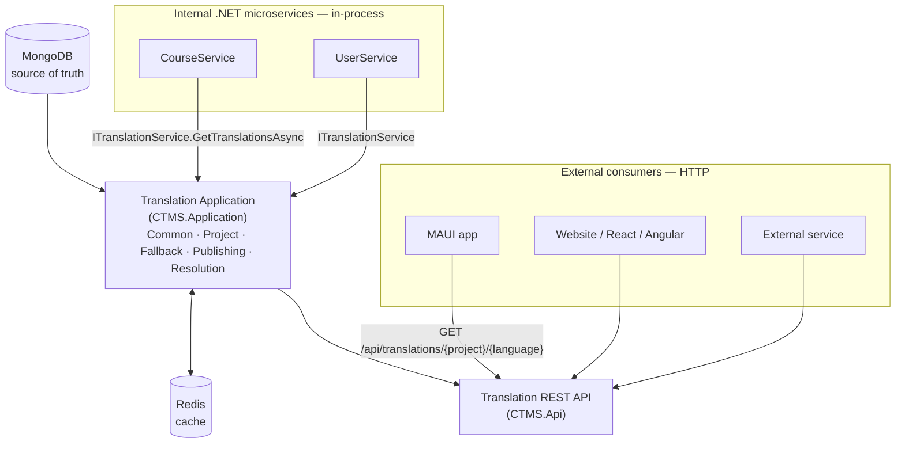
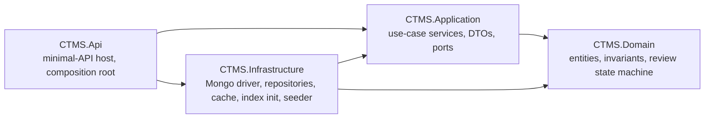
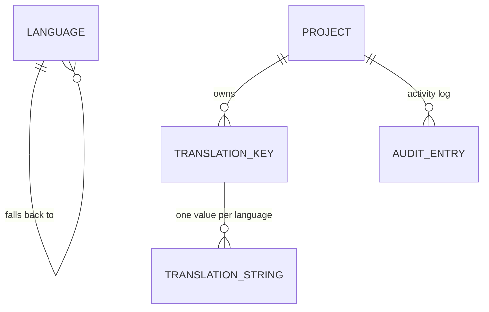
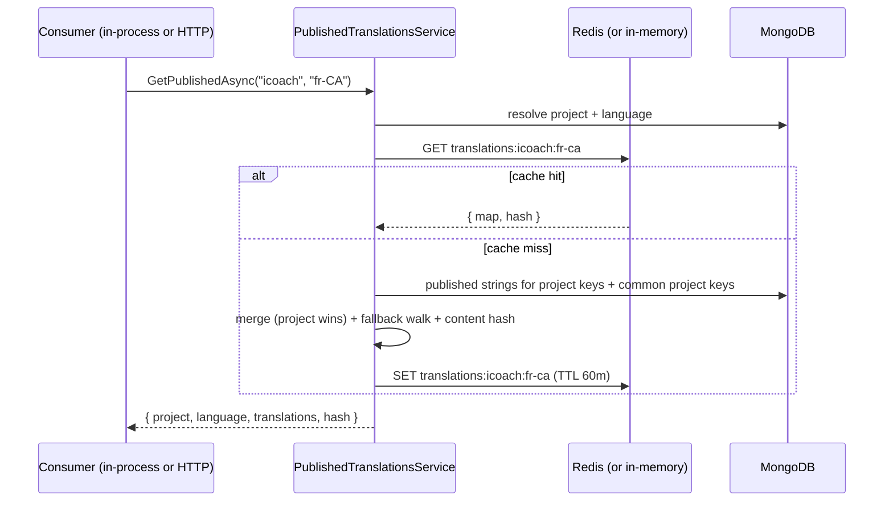
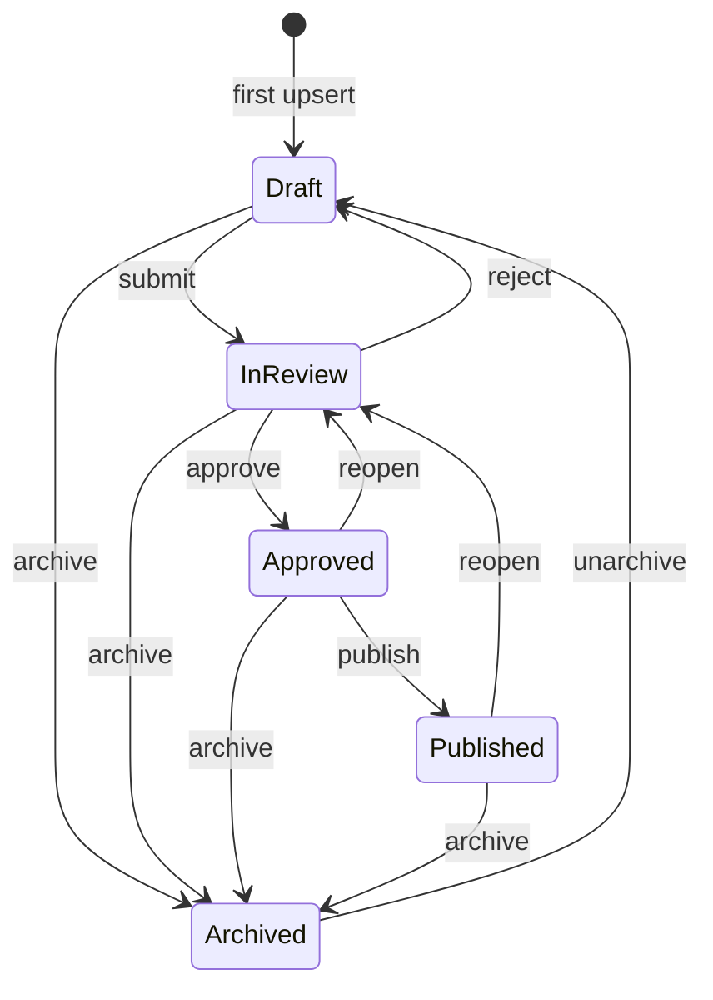

# CTMS architecture

Central Translation Management Service — a .NET 10 / C# service that is the
**single source of truth for translations** across the organisation. It stores
translation strings for many **projects** (applications) and **languages**, runs
them through a review/approval workflow, and serves **assembled-on-demand**
published translations.

The product specification is [`CLAUDE.md`](../CLAUDE.md). This document is the
big picture; the rest of `docs/` drills into each area.

---

## 1. One engine, two consumption paths

There is exactly **one** translation engine, `ITranslationService`
(`CTMS.Application/Translations`). It has two entry points that produce a
**byte-identical** result:

- **Internal .NET microservices** in the wider solution call
  `services.AddTranslationServices(configuration)` (in `CTMS.Infrastructure`,
  namespace `CTMS.Infrastructure`), inject `ITranslationService`, and call
  `GetTranslationsAsync(project, language, ct)` directly — **no HTTP, no direct
  Mongo/Redis access**. See [`internal-consumption.md`](internal-consumption.md).
- **External applications** call
  `GET /api/translations/{project}/{language}` with ETag / `If-None-Match` /
  `304`. See [`external-consumption.md`](external-consumption.md).

The REST endpoint (`TranslationEndpoints`) is a thin adapter: it calls the same
`ITranslationService`, sets the `ETag` header, and answers `304`. It contains no
translation resolution logic.

`TranslationService` delegates to `PublishedTranslationsService`, so the
resolve / common-merge / fallback / hash / cache read-through logic lives in
exactly one place.

## 2. Solution layout and dependency direction

| Project | Responsibility |
|---|---|
| **CTMS.Domain** | Entities and rules. No framework dependencies. Most entities derive from `Entity` (`Guid Id`, `CreatedAt`, `UpdatedAt`, `internal` setters); constructors and methods guard invariants; setters are private. `AuditEntry` is the exception — append-only, only `Id` + `Timestamp`. |
| **CTMS.Application** | Use-case orchestration and the ports it needs. **DTOs — never entities — cross the API boundary.** `AddApplication()` registers the services. No dependency on ASP.NET or HTTP: this is what lets internal microservices use it directly. |
| **CTMS.Infrastructure** | Data access + cache. `AddInfrastructure(IConfiguration)` wires the Mongo client/context, the five repositories, `NoOpUnitOfWork`, `MongoHealthCheck`, the translations cache, and the `MongoIndexInitializer` / `DataSeeder` hosted services. `AddTranslationServices(IConfiguration)` = `AddApplication()` + `AddInfrastructure()` — the single entry point for an internal .NET consumer. |
| **CTMS.Api** | Minimal-API host. Composition root only. Endpoints grouped per resource under `Endpoints/*`; known exceptions → RFC 7807 via `ApplicationExceptionHandler`; production hardening in `Infrastructure/*Setup.cs`; auth in `Auth/*`. |
| **CTMS.AdminUI** | Blazor Web App (InteractiveServer). Entra ID OIDC sign-in; calls the management API with an on-behalf-of bearer token. Keeps a byte-identical copy of `AuthRoles` / `AuthorizationPolicies`. |
| **CTMS.Client** | Optional NuGet client library for the REST API (`netstandard2.0` + `net10.0`). A client of the API; it does not replace the service. See [`maui-client.md`](maui-client.md). |

`CTMS.Client` and `CTMS.AdminUI` reach `CTMS.Api` over **HTTP only** — never the
Application or Infrastructure assemblies directly.

## 3. Domain aggregates

| Aggregate | Summary | Invariants |
|---|---|---|
| **Project** (a translatable *application*) | `Id`, `Name`, `Slug`, `Description?`, `BaseLanguageCode`, `IsCommon`, `Active`, `EnabledLanguageCodes` | `Slug` unique, lower-cased, trimmed — it is the **project code** on every route. `IsCommon` marks a project (e.g. `common`) whose published strings merge into every other project's delivered map. `EnabledLanguageCodes` is ordinal, de-duplicated; enable/disable validate the language exists and is active. |
| **Language** | `Id`, `Code` (BCP-47), `Name`, `FallbackCode?`, `IsRtl`, `Active` | **Global** — one catalogue, not scoped to a project. `Code` unique. `FallbackCode`, when set, names another language and must not equal this one's `Code`. Inactive languages are hidden from delivery and rejected by the assembler. |
| **TranslationKey** | `Id`, `ProjectId`, `KeyName` (dotted path), `Category`, `Description?`, `Active`, `CreatedBy` | Unique `(ProjectId, KeyName)`. `KeyName` matches `[A-Za-z0-9_.-]+`. `Category` non-blank (derived from the key-name prefix when the caller omits it — `CategorySuggestion`). Inactive keys are excluded from delivery and coverage. |
| **TranslationString** | `Id`, `TranslationKeyId`, `LanguageCode`, `Value`, `ReviewState`, `UpdatedBy` | Unique `(TranslationKeyId, LanguageCode)`. `ReviewState` moves only through `ChangeReviewState` (§5). **Last write wins — no version / concurrency token.** |
| **AuditEntry** | `Id`, `ProjectId`, `EntityType`, `EntityId`, `Action`, `Actor`, `Timestamp` (UTC), `FromState?`, `ToState?`, `Detail?`, `OldValue?`, `NewValue?` | Append-only — never updated or deleted, so no `CreatedAt`/`UpdatedAt`. `NewValue` on `Created`; both on `Edited`; both null on review transitions. Not exposed to consumers. |

There is no `Locale` aggregate (replaced by the global `Language`) and no
`TranslationBundle` aggregate (replaced by assemble-on-demand delivery, §4).
There are **no** `ApiKey` or `Webhook` aggregates.

## 4. Assemble-on-demand delivery

`PublishedTranslationsService.GetPublishedAsync(project, language)` — there are
**no stored bundles and no version numbers**:

1. **Resolve.** Look up the project by slug (404 unknown / inactive) and the
   language by code (404 unknown / inactive, or not in the project's
   `EnabledLanguageCodes`).
2. **Cache check.** If `translations:{project}:{language}` is present, return the
   cached map + hash without assembling.
3. **Gather published strings.** `TranslationString`s with
   `ReviewState == Published` for this project's active keys **plus every
   `IsCommon` project's** active keys. `Archived` is never included.
4. **Merge.** Walk this project's keys first, then the common projects' keys; a
   common key whose name already resolved from the project is skipped — the
   **project-specific value wins** on a key-name collision (spec §22).
5. **Fallback walk.** For a key with no `Published` value in `{language}`, follow
   `Language.FallbackCode` (`fr-CA` → `fr-FR` → `en-GB`), cycle-guarded, and take
   the first `Published` value. A key with no published value anywhere is
   **omitted**.
6. **Order + hash.** Order by key (ordinal); compute the content hash
   (`TranslationContentHash`, [`etag.md`](etag.md)). Store `{ map, hash }` in the
   cache; return it.

**Publishing** is a single action:
`POST /api/translations/publish` (`{ project, language? }`) promotes every
`Approved` string for the project (optionally one language) to `Published`,
writes a `Published` audit entry per string, and invalidates the delivery cache
([`caching.md`](caching.md)). The per-string `publish` review action does the
same for one string.

## 5. Translation lifecycle

Each `TranslationString` moves through this machine
(`TranslationString.ChangeReviewState`; any other pair throws
`InvalidReviewTransitionException` → HTTP 409):

Only **`Published`** strings are served to consumers. `Archived` is retired and
hidden everywhere. Editing a string that has left `Draft` (`InReview`,
`Approved`, `Published`) sends it back to `InReview`; a `Draft` stays a `Draft`;
an `Archived` string stays `Archived`. Full transition table and the coverage
definition: [`translation-workflow.md`](translation-workflow.md).

## 6. Persistence — MongoDB

Source of truth. Only CTMS touches the translation collections. Details:
[`database.md`](database.md).

- `AddInfrastructure` registers a singleton `IMongoClient` from
  `ConnectionStrings:CtmsDatabase`, a singleton `IMongoContext` →
  `CtmsMongoContext` on database `Mongo:Database` (default `ctms`), five scoped
  repositories, `NoOpUnitOfWork`, `MongoHealthCheck` (tag `ready`), the
  translations cache, and the `MongoIndexInitializer` + `DataSeeder` hosted
  services.
- **No migration tool.** `MongoIndexInitializer` runs `createIndexes`
  (idempotent) on every startup; schema evolution is additive and
  `IgnoreExtraElements` tolerates unknown fields.
- `NoOpUnitOfWork` — each repository call is a single-document atomic write.
  Cross-document consistency (publish + audit) relies on operation ordering and
  idempotency, not a transaction.
- Referential integrity and cascade deletes are enforced in the services /
  repositories.

## 7. Redis cache

Cache only; MongoDB stays the source of truth. Read-through, key
`translations:{project}:{language}`, TTL `Cache:TranslationsTtlMinutes`
(default 60). Backed by StackExchange.Redis when `ConnectionStrings:Redis` is
set, otherwise an in-process `IDistributedCache` — behaviour is identical.
Invalidated when a string enters or leaves `Published`, on bulk publish, and on
bulk review; a **`common`** change fans the invalidation out to every project for
the affected languages. A Redis outage degrades to on-demand assembly and is
**not** a readiness dependency (spec §50). Details: [`caching.md`](caching.md).
Redis also backs the ASP.NET Data Protection key ring
([`authentication.md`](authentication.md)).

## 8. Security

Authentication: Microsoft **Entra ID / OpenID Connect** for the management
surface. Authorization: five roles → six named policies, enforced at the API
layer. The consumer read is anonymous by default (`Auth:PublicBundleReads`).
Details: [`authentication.md`](authentication.md),
[`authorisation.md`](authorisation.md).

## 9. Health, logging, failure behaviour

- `GET /health`, `GET /health/live` — liveness, no checks.
- `GET /health/ready` — readiness; runs `MongoHealthCheck` (`{ ping: 1 }`). No
  Redis check.
- Structured JSON console logging outside Development; `TraceId` on every scope,
  lining up with the `traceId` on RFC 7807 error bodies; one HTTP log line per
  request (`/health*` excluded).
- Redis down → serve from MongoDB. MongoDB down → `/health/ready` is `503` and
  delivery raises an error rather than returning wrong data (spec §50).

## 10. Configuration and secrets

Config resolves `appsettings.json` → `appsettings.{Environment}.json` →
environment variables (`__` maps to `:`). **No credentials are committed** —
`appsettings.json` ships a passwordless localhost Mongo placeholder. Key
settings:

| Key | Env override | Meaning |
|---|---|---|
| `ConnectionStrings:CtmsDatabase` | `ConnectionStrings__CtmsDatabase` | MongoDB connection string (required) |
| `Mongo:Database` | `Mongo__Database` | Database name (default `ctms`) |
| `ConnectionStrings:Redis` | `ConnectionStrings__Redis` | Redis (`host:port[,options]`); unset ⇒ in-process cache |
| `Cache:TranslationsTtlMinutes` | `Cache__TranslationsTtlMinutes` | Cached-map TTL (default 60) |
| `Auth:Enabled` | `Auth__Enabled` | `false` = dev all-roles bypass; refused under Production |
| `Auth:PublicBundleReads` | `Auth__PublicBundleReads` | `true` = anonymous consumer read |
| `AzureAd:Instance` / `:TenantId` / `:ClientId` / `:Audience` | `AzureAd__*` | Entra ID app registration for JWT validation |
| `Seed:Enabled` | `Seed__Enabled` | Dev-only data seeder |
| `Cors:AllowedOrigins` | `Cors__AllowedOrigins__0` … | Browser origins allowed by the `ctms` CORS policy (empty ⇒ none) |
| `RateLimit:*` | `RateLimit__*` | Global fixed-window limiter knobs |
| `Limits:MaxRequestBodyBytes` / `:MaxImportBodyBytes` | `Limits__*` | 256 KB body cap; 5 MB for the import route |

Target managed services (see [`azure-deployment.md`](azure-deployment.md)):
Azure Cosmos DB for MongoDB and Azure Cache for Redis, connection strings in Key
Vault. The container terminates TLS upstream and listens HTTP-only on `:8080`.

## 11. Production hardening

Config-driven, inert in Development/tests. `CorsSetup` (one `ctms` policy, empty
allow-list ⇒ no cross-origin), `RateLimitingSetup` (global partitioned
fixed-window limiter; the anonymous delivery GET gets its own looser IP
partition; `429` + RFC 7807 + `Retry-After`), `RequestBodySizeLimit` (`413` +
RFC 7807; the import route opts into a larger ceiling), `DataProtectionSetup`
(key ring to Redis), `LoggingSetup` (JSON console + trace ids). Rationale:
[`adr/0003-production-hardening.md`](adr/0003-production-hardening.md).

## 12. Testing

Three xUnit projects, ~287 cases. Application services run end-to-end against a
real in-process MongoDB (`EphemeralMongo`); the HTTP suite runs the real
`Program` through `WebApplicationFactory` (Testcontainers `mongo:7` when Docker
is present, else `EphemeralMongo`); the client suite runs against a stub handler.
`TranslationServiceRegistrationTests` verifies an internal consumer can register
and call `ITranslationService` with no HTTP. See
[`../CLAUDE.md`](../CLAUDE.md) and
[`existing-solution-assessment.md`](existing-solution-assessment.md).

## 13. Architecture decision records

[`adr/`](adr/) — Nygard format. `0001` (record ADRs) and `0002` (MongoDB) stand.
`0003`–`0005` are partly superseded by this document — see
[`adr/README.md`](adr/README.md): assemble-on-demand delivery and the model
simplification stand; the API-key and webhook decisions in `0005` are reverted.
