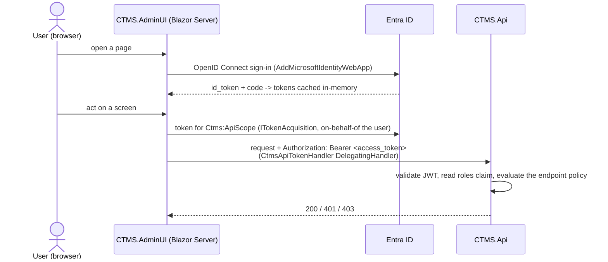

# Authentication

CTMS separates **management access** (protected) from **consumer access**
(anonymous by default). Spec §45.

- **Management API** — Microsoft **Entra ID / OpenID Connect**. The API validates
  JWT bearer tokens; the Admin UI signs users in interactively and calls the API
  on their behalf.
- **Consumer API** — `GET /api/translations/{project}/{language}` is anonymous
  while `Auth:PublicBundleReads=true` (the default).

Authorization (roles, policies, the matrix) is in
[`authorisation.md`](authorisation.md).

---

## API — JWT bearer validation

`src/CTMS.Api/Auth/AuthenticationSetup.cs`, `builder.AddCtmsAuth()`.
`Microsoft.Identity.Web`'s `AddMicrosoftIdentityWebApi` binds the `AzureAd`
configuration section and validates incoming `Authorization: Bearer <token>`
headers.

- A request with **no / an invalid token** to a protected endpoint gets `401`.
- An authenticated caller whose token carries **no recognised role** gets `403`
  on every protected endpoint.
- The API is a **token validator only** — it needs tenant id, client id, and
  audience, but **no client secret**. (The confidential-client secret belongs to
  the Admin UI.)

### `AzureAd:*` configuration

| Key | Env override | Meaning |
|---|---|---|
| `AzureAd:Instance` | `AzureAd__Instance` | Authority, e.g. `https://login.microsoftonline.com/` (override for sovereign clouds) |
| `AzureAd:TenantId` | `AzureAd__TenantId` | Directory (tenant) ID |
| `AzureAd:ClientId` | `AzureAd__ClientId` | The API app registration's client ID |
| `AzureAd:Audience` | `AzureAd__Audience` | Accepted token audience, e.g. `api://ctms` |

`appsettings.json` ships placeholders; real values come from user-secrets, Key
Vault, or container-app env. In Azure the deploy Bicep sets `AzureAd__*` as
plain (non-secret) container-app env when a tenant id is supplied
([`azure-deployment.md`](azure-deployment.md)).

## `Auth:Enabled` — the dev / test bypass

| `Auth:Enabled` | Behaviour |
|---|---|
| `true` (default; `appsettings.json`, `appsettings.Production.json`) | Real Entra ID JWT bearer validation. |
| `false` (`appsettings.Development.json`, the compose dev stack, the integration-test factory) | `DevBypassAuthHandler` replaces the JWT scheme: **every** request is authenticated as a synthetic principal `dev-bypass` holding **all** roles. A loud warning is logged at startup. |

**`Auth:Enabled=false` is refused at startup when
`ASPNETCORE_ENVIRONMENT=Production`** — `AddCtmsAuth` throws
`InvalidOperationException`. This is covered by
`ProductionStartupTests` in the integration suite.

## `Auth:PublicBundleReads` — the consumer read

| `Auth:PublicBundleReads` | `GET /api/translations/{project}/{language}`, `GET /api/projects`, `GET /api/languages` |
|---|---|
| `true` (default) | `AllowAnonymous` — the SDK / CDN / website delivery path works with no token. |
| `false` | Require `CanRead` — a fully private deployment. |

Applied by `EndpointConventions.GatePublicRead`. Every **other** `/api/*` route —
the catalogue `GET {code}` reads, every management screen, and all writes —
always requires a token regardless of this flag.

## Actor fields come from the token

`src/CTMS.Api/Auth/TokenActor.cs`. When a request carries a **real bearer
token**, the actor recorded on a write (`updatedBy` on a string upsert,
`reviewedBy` on a review, `createdBy` on a key create, the bulk-publish actor)
is taken from the token — `name`, then `preferred_username` / `upn` / email,
then the object id (`oid`) — and any value in the request body is **ignored**.
The body field applies only when the request is anonymous or authenticated by
the dev bypass. History therefore always attributes a change to the real signed-in
user in a deployed environment.

---

## Admin UI — OpenID Connect + on-behalf-of

`src/CTMS.AdminUI/Program.cs`. A Blazor Web App (InteractiveServer). It is a
**confidential client**.

- **Sign-in** — `AddMicrosoftIdentityWebApp(builder.Configuration.GetSection("AzureAd"))`
  with `CallbackPath` `/signin-oidc`. `AddMicrosoftIdentityUI` supplies the
  `/MicrosoftIdentity/Account/SignIn|SignOut` endpoints.
- **Token acquisition** —
  `.EnableTokenAcquisitionToCallDownstreamApi([apiScope]).AddInMemoryTokenCaches()`.
  `CtmsApiTokenHandler` (`Services/CtmsApiTokenHandler.cs`), a `DelegatingHandler`
  on the typed `CtmsApiClient`, calls
  `ITokenAcquisition.GetAccessTokenForUserAsync([Ctms:ApiScope])` and attaches
  the result as `Authorization: Bearer …` to every API call. If interactive
  sign-in is needed again (`MsalUiRequiredException` /
  `MicrosoftIdentityWebChallengeUserException`) it short-circuits with a
  synthetic `401` so the next full-page navigation re-runs the OIDC challenge.
- **Admin UI config keys** — `Ctms:ApiBaseUrl` (default
  `http://localhost:8080`), `Ctms:ApiScope` (e.g.
  `api://<api-client-id>/access_as_user`, **required when `Auth:Enabled=true`**),
  `AzureAd:Instance` / `:TenantId` / `:ClientId` / `:CallbackPath`, and the Admin
  UI's own client secret (a Key Vault secret, e.g.
  `AdminUi-AzureAdClientSecret`).
- The Admin UI has its own `Auth:Enabled=false` dev bypass and the same
  Production refusal.

## Data Protection key ring

Both hosts persist the ASP.NET Core Data Protection key ring (antiforgery
tokens, auth-cookie protection) to **Redis** when `ConnectionStrings:Redis` is
set (`PersistKeysToStackExchangeRedis`, key `DataProtection-Keys`,
`SetApplicationName("CTMS")`), so every replica shares one set of keys and they
survive a restart. Unset ⇒ a local ephemeral ring plus an info log. At-rest key
encryption (certificate / Key Vault) is a `TODO`.

## Related

- [`authorisation.md`](authorisation.md) — roles, policies, the endpoint matrix.
- [`external-consumption.md`](external-consumption.md) — sending a token from an
  external client when `Auth:PublicBundleReads=false`.
- [`adr/0003-production-hardening.md`](adr/0003-production-hardening.md).
