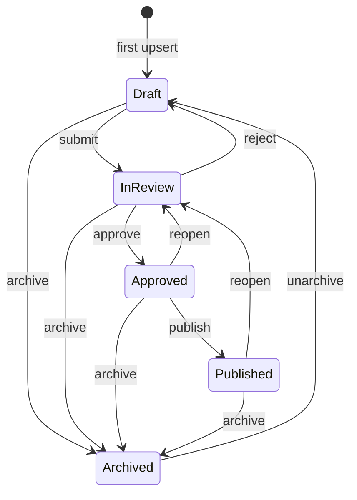

# Translation workflow

Every `TranslationString` moves through a review lifecycle. Only **`Published`**
strings are served to consumers; **`Archived`** strings are retired and hidden
everywhere (spec §25).

Transition rules live on
`TranslationString.ChangeReviewState(target, reviewedBy)`
(`CTMS.Domain/Translations`); every other `(from, to)` pair throws
`InvalidReviewTransitionException` → HTTP `409`. A successful transition sets
`UpdatedBy` to the reviewer.

---

## States

| State | Meaning | Served to consumers? |
|---|---|---|
| `Draft` | Being written; not yet submitted | no |
| `InReview` | Submitted, awaiting a decision | no |
| `Approved` | Passed review, not yet released | no |
| `Published` | Released — part of the assembled delivery map | **yes** |
| `Archived` | Retired from the workflow; hidden everywhere; excluded from coverage | no |

## State machine

## Transition table

| `action` | from → to | audit action | policy |
|---|---|---|---|
| `submit` | `Draft` → `InReview` | `Submitted` | `CanReview` |
| `approve` | `InReview` → `Approved` | `Approved` | `CanReview` |
| `reject` | `InReview` → `Draft` | `Rejected` | `CanReview` |
| `reopen` | `Approved` → `InReview`, or `Published` → `InReview` | `Reopened` | `CanReview` |
| `publish` | `Approved` → `Published` | `Published` | `CanReview` (single string) / `CanPublish` (`POST /api/translations/publish`) |
| `archive` | `Draft` / `InReview` / `Approved` / `Published` → `Archived` | `Archived` | `CanReview` |
| `unarchive` | `Archived` → `Draft` | `Unarchived` | `CanReview` |

Applied via:

- `POST /api/projects/{project}/keys/{keyId}/strings/{language}/review` — one
  string, body `{ action, reviewedBy }`.
- `POST /api/projects/{project}/review-bulk` — one action across a filtered set
  (`language` / `category` / `keyIds`, at least one required); illegal
  transitions are **skipped**, not errored.
- `POST /api/translations/publish` — promotes **every `Approved` string** for a
  project (optionally one language) through `Approved → Published`.

> `CLAUDE.md` §25's list of actions is `submit / approve / reject / reopen`. The
> implementation additionally supports `publish`, `archive`, and `unarchive` (see
> `TranslationStringService.ResolveReviewAction` and
> `TranslationString.ChangeReviewState`). Code is the source of truth.

## Who can do what

See [`authorisation.md`](authorisation.md) for the full matrix. In short:

| Role | Can |
|---|---|
| `TranslationAdministrator` | everything |
| `TranslationManager` | edit, submit-via-review, approve, reject, reopen, archive, publish |
| `TranslationReviewer` | edit, submit, approve, reject, reopen, archive, `publish` action |
| `Translator` | edit string values, read (see the §46 divergence note in `authorisation.md`) |
| `TranslationReadOnly` | read |

## Edit semantics

`TranslationString.Edit(value, editedBy)` (called by the string upsert when the
row already exists):

- a `Draft` stays a `Draft`;
- `InReview`, `Approved`, or `Published` → back to **`InReview`** — approved or
  published text cannot be changed without re-review;
- an `Archived` string stays `Archived` (edit it only after `unarchive`).

There is **no optimistic concurrency**. The upsert is last-write-wins: an
unchanged value is a no-op; a changed value overwrites whatever is stored and
records an `Edited` audit entry with `oldValue` / `newValue`. A concurrent edit
by another actor is overwritten silently — the mitigations are the review
workflow (a non-`Draft` edit drops back to `InReview`) and the audit trail.

When an edit knocks a **`Published`** string back to `InReview`, the delivery
cache for that `(project, language)` is invalidated ([`caching.md`](caching.md)).

## Coverage / "missing"

For the dashboard and the missing-translations screen, a key counts as
**translated** in a language when a `TranslationString` exists in **any state
other than `Draft` or `Archived`** — i.e. `InReview`, `Approved`, or
`Published`. See [`api.md` → Management screens](api.md#management-screens).

## Translation history (audit)

Every state-changing operation on a `TranslationString` writes an `AuditEntry`
inline, before `SaveChanges`:

| Field | Notes |
|---|---|
| `projectId` | owning project's id |
| `entityType` / `entityId` | `"TranslationString"` / the string id |
| `action` | `Created`, `Edited`, `Submitted`, `Approved`, `Rejected`, `Reopened`, `Published`, `Archived`, `Unarchived` |
| `actor` | the token identity when a real bearer token is present, else the request-body `updatedBy` / `reviewedBy` |
| `timestamp` | UTC |
| `fromState` / `toState` | `ReviewState` names on a review transition |
| `oldValue` / `newValue` | value diff — `newValue` on `Created`, both on `Edited`, both null on a review transition |

Audit entries are **append-only** — never updated or deleted. They are **not
exposed to consumers**; the read-only history endpoints
(`GET /api/projects/{project}/history`,
`…/keys/{keyId}/strings/{language}/history`) require `CanRead`. Purpose:
auditing, change tracking, investigation, rollback support (spec §26). This is
**not** numeric translation versioning (spec §27).
